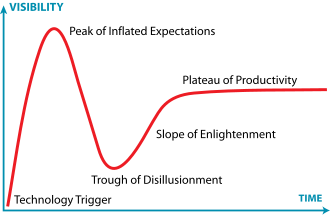
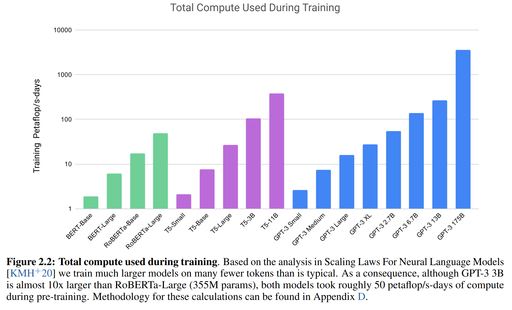
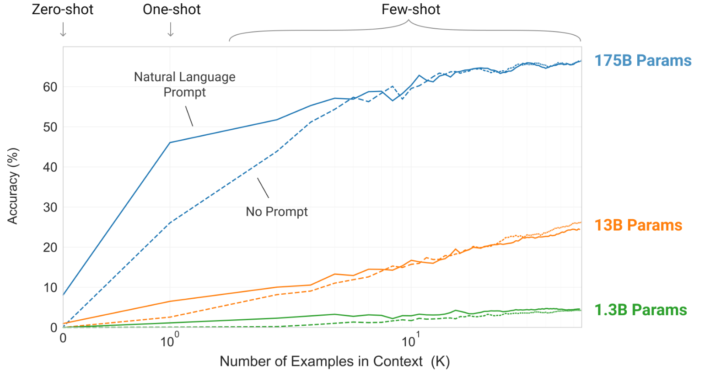
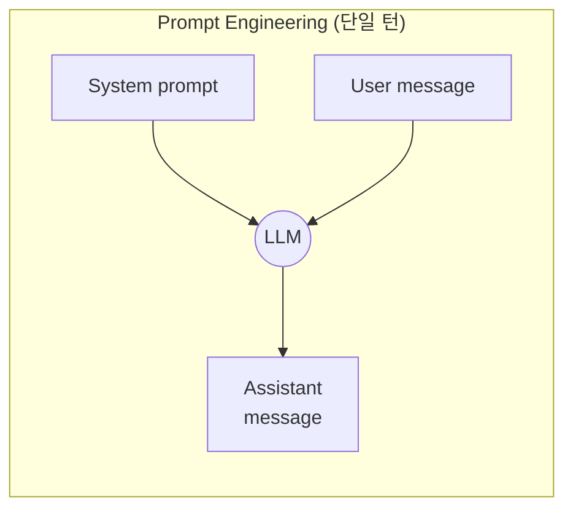
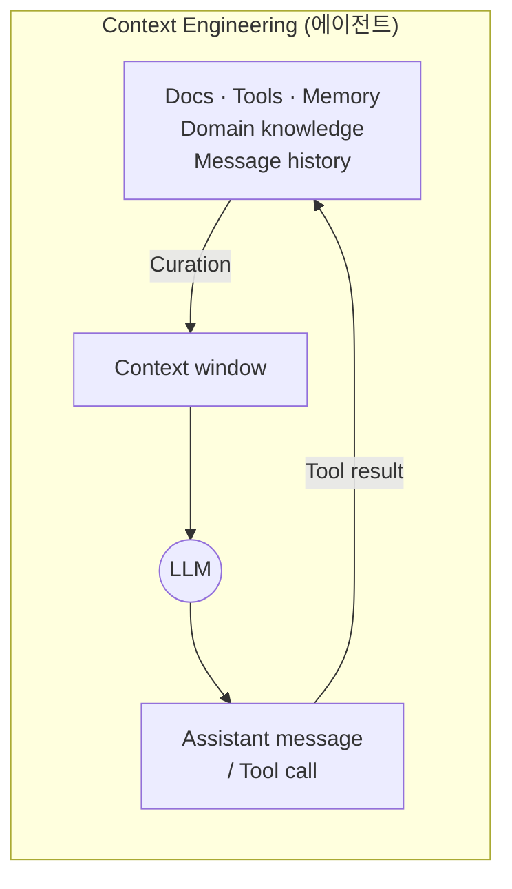

_강의자료와 수업을 기반으로 학습 내용을 정리하지만, 혹시 모를 저작권 등의 문제로 이미지 첨부는 최대한 '지양'한다._


SKALA 부트캠프 **생성형AI** 과정의 첫 모듈이다. 7월 15일(수) 하루 동안 진행됐고, 커리큘럼 전체에서 보면 이후의 LLM·RAG·AI Agent 과정으로 이어지는 출발점에 해당한다.

전기공학 전공으로 시작해 4년간 AI 연구를 해온 입장에서 이 주제의 상당 부분은 이미 익숙했다. 그래서 "프롬프트를 이렇게 쓰면 좋다"는 팁 모음으로 정리하는 대신, 다음 두 가지에 초점을 맞췄다.

1. **왜 그 기법이 통하는지를 디코딩 과정과 논문으로 확인한다** — temperature를 올리면 왜 창의적이 되는가, few-shot이 왜 모델이 커야 효과가 있는가
2. **프롬프트 엔지니어링이 어디서 한계에 부딪히는지를 남긴다** — 이 강의의 마지막 3분의 1이 정확히 그 이야기였고, 개인적으로 가장 얻은 것이 많았다

강의 자체의 구도가 그 흐름을 보여준다.

```text
생성형AI 트렌드      →  왜 지금 이 얘기를 하는가
동작 원리와 한계      →  다음 토큰 예측 · hallucination
Prompt Engineering  →  토큰 · 샘플링 파라미터 · RICE 구조
기법들              →  few-shot · CoT · Step-back · Self-Consistency
논문                →  기법의 근거와 조건
그 너머             →  Context Engineering · Harness Engineering
```

> 강의자료는 개념 지도를 잡는 참고 자료로 활용하고, 설명·예시·수치는 원 논문과 공식 문서로 확인해 재구성했다. 본문에서 "확인해 보니"로 시작하는 대목은 슬라이드의 서술을 원문과 대조해 바로잡은 부분이다.
{: .prompt-info }

## 왜 지금 프롬프트인가 — Hype Cycle로 본 위치



강의는 Gartner Hype Cycle을 연도별로 나열하며 시작했다. 나열 자체보다 **같은 기술이 해마다 어디로 이동했는가**가 흥미로웠다.

곡선을 읽으려면 다섯 단계의 이름을 알아야 한다. 세로축은 기술의 성능이 아니라 **기술에 대한 기대치**다.

| 단계 | 원어 | 상태 |
|---|---|---|
| ① 혁신 촉발 | Innovation Trigger | 개념 증명만 있고 상용 제품은 없다 |
| ② 부풀려진 기대의 정점 | Peak of Inflated Expectations | 성공 사례가 과장되어 퍼진다 |
| ③ 환멸 | Trough of Disillusionment | 시범 도입이 기대에 못 미쳐 관심이 식는다 |
| ④ 계몽 | Slope of Enlightenment | 실제로 통하는 용례가 추려진다 |
| ⑤ 생산성 안정 | Plateau of Productivity | 주류 기술로 자리 잡는다 |

③의 "환멸"은 기술이 실패했다는 뜻이 아니다. 이 모델에서 ③은 살아남을 기술이 **반드시 지나가는 길목**이고, 바로 다음이 ④·⑤다. 기대치가 실제 성능 쪽으로 내려와 만나는 구간이라고 보는 편이 정확하다.

| 연도 | 기대의 정점에 있던 것 | 비고 |
|---|---|---|
| 2014 | Big Data, Data Science | 2018년에는 이미 성숙 단계로 이동 |
| 2018 | Deep Neural Nets | AGI는 여전히 Innovation Trigger |
| 2023 | Generative AI | Prompt Engineering도 정점 부근 |
| 2024 | RAG, Prompt Engineering, Vector DB | LLM은 정점을 지나 하강 시작 |
| 2025 | **AI Agents** | **Generative AI는 환멸 단계(Trough)로 진입** |

2025년 곡선에서 Generative AI가 환멸 단계에 들어가 있다는 점이 이 강의의 출발점이다. 기술이 사라진다는 뜻이 아니라 **"되는 것과 안 되는 것을 가리는 구간"**에 들어섰다는 의미다. 그리고 그 자리를 AI Agent가 물려받았다.

AI의 역할 변화를 세 단계로 정리한 슬라이드가 이 시리즈 전체의 지도 역할을 한다.

```text
답변하는 AI          →  근거를 찾아 답하는 AI    →  스스로 실행하는 AI
Prompt Engineering     LLM Reasoning + RAG        AI Agent
"AI가 답변을 한다"      "의도한 대로 답을 받아낸다"   "시킨 일을 알아서 한다"
```

여기서 짚어 둘 것은 **이 셋이 대체 관계가 아니라 누적 관계**라는 점이다. Agent 시대가 왔다고 프롬프트가 필요 없어지는 게 아니라, Agent를 구성하는 각 단계마다 프롬프트가 들어간다. 뒤에 나올 Context Engineering이 정확히 이 지점의 이야기다.

Agent 구조의 효과를 보여주는 수치도 인상적이었다. 코딩 벤치마크 기준으로 GPT-3.5 zero-shot이 48.1%, GPT-4 zero-shot이 67.0%인데, **GPT-3.5에 에이전틱 워크플로를 붙이면 95.1%**가 나온다. 슬라이드에 출처가 없어 찾아보니 Andrew Ng이 2024년에 HumanEval 기준으로 제시한 수치였다. 열위 모델이 구조로 우위 모델을 이긴다는 것이 요지다.

> 이 수치를 인용할 때는 조건을 함께 말해야 한다. HumanEval은 짧은 함수 단위 문제이고 반복 실행·자기 검증이 잘 통하는 형태다. 모든 태스크에서 에이전트 구조가 2배의 이득을 준다는 뜻은 아니다.
{: .prompt-warning }

## 동작 원리 — 다음 토큰 예측이 전부다

### 언어 모델은 무엇을 하는가

```text
"퇴근 후 공항에 택시를 타고 갔는데, 탑승시간에 늦어서 결국 비행기를 ( ___ )"

놓쳤다  0.72
탔다    0.15
봤다    0.08
```

**주어진 시퀀스 다음에 올 토큰의 확률분포를 계산하는 것**, 그게 전부다. 이 단순한 정의에서 프롬프트 엔지니어링의 존재 이유가 곧바로 나온다. 우리가 통제할 수 있는 것은 모델의 가중치가 아니라 **조건부 확률의 조건에 해당하는 앞부분**뿐이다.

$$
P(w_t \mid w_1, w_2, \ldots, w_{t-1})
$$

프롬프트는 이 조건 $w_1 \ldots w_{t-1}$을 설계하는 일이다. 역할을 부여하거나 예시를 주는 것이 효과가 있는 이유도 여기 있다 — 조건이 달라지면 분포가 달라진다.

### 규모와 그 대가

강의는 GPT-3의 학습 데이터 구성표(Brown et al. 2020, Table 2.2)를 보여주며 규모를 설명했다.

| 데이터셋 | 분량(토큰) | 학습 혼합 비중 |
|---|---:|---:|
| Common Crawl (filtered) | 410B | 60% |
| WebText2 | 19B | 22% |
| Books1 | 12B | 8% |
| Books2 | 55B | 8% |
| Wikipedia | 3B | 3% |

> 슬라이드는 "약 500B (5,000억) Token이 포함된 데이터셋 학습"이라고 적었다. 확인해 보니 **코퍼스 총량이 약 499B이고 실제 학습에 쓴 토큰은 300B**다. 같은 슬라이드에 실린 표의 마지막 열 제목이 "Epochs elapsed when **training for 300B tokens**"라 표 자체가 이미 그 사실을 담고 있다. 가중 샘플링 때문에 Wikipedia는 3.4 epoch을 도는 반면 Common Crawl은 0.44 epoch만 도는 구조다. [LLM 2일차 시리즈](/posts/skala-transformer-roadmap/)에서도 같은 수치가 같은 방식으로 잘못 적혀 있었는데, 두 자료가 같은 출처를 공유하는 것으로 보인다.
{: .prompt-warning }

> 논문 제목도 하나 짚어 둔다. 슬라이드의 "GPT1 - 2018, Improving Language Understanding **with Unsupervised Learning**"은 OpenAI **블로그 포스트** 제목이고, 논문 제목은 "Improving Language Understanding **by Generative Pre-Training**"이다.
{: .prompt-warning }

여기서 강의가 던지는 질문이 좋았다. **학습에 쓴 텍스트가 전부 사실인가? 누가 검증했는가?** 웹 크롤링이 60%를 차지하는 데이터로 학습한 모델이 그럴듯한 거짓말을 하는 것은 버그가 아니라 구조적 귀결이다. 그리고 학습 비용 때문에 자주 재학습할 수 없다는 점이 최신성 문제로 이어진다.

기업이 LLM을 도입할 때 부딪히는 세 가지 허들도 전부 이 지점에서 파생된다.

- **내부 정보의 부재** — 사내 문서나 폐쇄적 전문 영역은 학습되지 않았다
- **적시성** — 학습 시점 이후의 정보를 모른다
- **환각** — 모르는 것을 모른다고 하지 않는다

이 셋이 뒤에 나올 RAG와 Context Engineering의 존재 이유다.

## Prompt Engineering 기초

### 토큰 — 과금과 한계의 단위

토큰은 텍스트 처리의 기본 단위이자 **비용과 컨텍스트 한계가 계산되는 단위**다.

```text
"I love AI."       → 4 tokens  / 10 characters
"나는 AI를 좋아한다."  → 6 tokens  / 12 characters
```

영어는 대략 1,000 토큰 ≈ 750 단어라는 경험칙이 있지만, **한국어는 토크나이저가 더 잘게 쪼개서 같은 의미에 더 많은 토큰을 쓴다.** 위 예시에서 글자 수는 비슷한데 토큰 수가 1.5배다. 한국어 서비스의 API 비용을 추정할 때 영어 기준 경험칙을 그대로 쓰면 과소 추정된다.

### 샘플링 파라미터 — 확률분포를 어떻게 자를 것인가

가장 확률이 높은 토큰이 항상 선택되는 것은 아니다. 후보 분포를 만든 뒤 **어떻게 자르고 어떻게 뽑을지**를 결정하는 파라미터가 따로 있다.

| 파라미터 | 하는 일 | 방향 |
|---|---|---|
| **Temperature** | 분포의 뾰족함을 조절 | 0에 가까울수록 결정적, 높을수록 무작위 |
| **Top-k** | 상위 k개 토큰만 후보로 | 작을수록 보수적 |
| **Top-p** | 누적 확률 p까지의 토큰만 후보로 | 작을수록 보수적 |
| **Min-p** | 확률이 너무 낮은 토큰 제거 | 잡음 제거 |
| **Max tokens** | 생성할 최대 토큰 수 | 비용·지연과 직결 |

Temperature가 하는 일은 softmax 직전에 로짓을 $T$로 나누는 것이다.

$$
P(w_i) = \frac{\exp(z_i / T)}{\sum_j \exp(z_j / T)}
$$

$T \to 0$이면 최댓값 하나만 살아남아 greedy decoding이 되고, $T$가 커지면 분포가 평평해져 낮은 확률의 토큰도 뽑힐 여지가 생긴다. "창의적"이라는 표현이 가리키는 것은 이 평평해짐이다.

> **적용 순서를 슬라이드와 다르게 적었다.** 슬라이드는 "Top-k, Top-p 기준을 통과한 토큰을 대상으로 Temperature가 적용됨"이라고 설명하는데, 실제 구현은 **반대**다. HuggingFace `transformers`, vLLM 등 표준 구현은 로짓에 **temperature를 먼저 적용하고, 그 결과에 top-k → top-p 필터를 건다.**
>
> 순서가 실제로 결과를 바꾸는 것은 **top-p**다. top-k는 상위 k개를 고르는 것이라 단조 변환인 temperature scaling에 영향을 받지 않지만, top-p는 누적 확률로 자르므로 분포가 얼마나 평평한지에 따라 통과하는 토큰 집합이 달라진다. temperature를 나중에 적용하면 "누적 90%"의 의미 자체가 달라진다.
{: .prompt-warning }

### Temperature를 얼마나 올릴 것인가

슬라이드는 "사실적인 응답 0.2~0.4, 창의적인 응답 1.6~1.8"을 제시했다. 앞의 값은 타당한데 뒤의 값에는 유보가 필요하다. **흥미롭게도 같은 강의자료가 뒤에서 그 근거를 스스로 무너뜨린다.**

- 바로 다음 슬라이드가 "극단적인 창의성"이라는 제목으로, 온도를 극단까지 올린 모델이 여러 언어가 뒤섞인 의미 없는 문자열을 뱉는 화면을 보여준다
- 5장에서 인용한 *Is Temperature the Creativity Parameter of Large Language Models?* (2024)는 온도를 올려도 **의미적·어휘적 다양성은 크게 늘지 않고 perplexity만 올라간다**는 결과를 보여준다. 논문의 표현을 그대로 옮기면 온도는 **참신성(novelty)과 약한 상관, 비일관성(incoherence)과 중간 정도의 상관**이 있고, **응집성(cohesion)·전형성(typicality)과는 아무 관계가 없었다**

정리하면 **온도를 올려서 얻는 것은 "창의성"이 아니라 "비일관성"에 가깝다.** 실무에서 1.6~1.8은 대부분 쓸 수 없는 구간이고, 다양성이 필요하면 온도를 극단으로 올리기보다 top-p를 조절하거나 여러 번 생성해 고르는 편이 낫다.

그리고 강의가 정확하게 짚은 실용적 포인트가 하나 있다. **temperature는 API 파라미터라 프롬프트 안에서 "temperature=0.2로 해라"라고 써도 제어되지 않는다.** 대신 출력의 성격을 규정하는 문장으로 유사한 효과를 얻는 편이 안정적이다.

```text
# temperature 0.2~0.3에 준하는 효과를 노리는 지시문
모델의 창의적 추론을 제한하고, 확정된 사실 및 데이터 기반으로만 응답하라.
가능한 경우 수치를 우선 사용하고, 모호한 표현(상당히, 매우, 높은 수준 등)은 금지한다.
결과는 재현 가능해야 하며, 동일 입력에 대해 변동이 발생해서는 안 된다.
```

이건 실제로 다른 메커니즘이다. temperature는 **디코딩 단계**를 건드리고, 위 지시문은 **조건부 분포 자체**를 바꾼다. 결과가 비슷해 보여도 경로가 다르다는 점은 알고 쓰는 게 좋다.

### reasoning.effort와 verbosity

GPT-5 계열에서 추가된 파라미터도 다뤘다. 개념적으로 깔끔한 분리다.

| 파라미터 | 결정하는 것 |
|---|---|
| `reasoning.effort` | **얼마나 깊이 생각할 것인가** (none / minimal / low / medium / high / xhigh) |
| `verbosity` | **얼마나 자세히 말할 것인가** (low / medium / high) |
| `temperature` | **얼마나 다양하게 표현하고 선택할 것인가** |

셋이 직교한다는 점이 요점이다. `reasoning.effort = high` + `temperature = 0` 조합이면 **깊게 분석하면서도 일관된 답변**을 기대할 수 있다. 등장 배경도 납득이 간다 — 모든 질문에 최고 수준의 추론을 돌리는 것은 비용 낭비이므로, 난이도에 따라 추론량을 조절하는 손잡이가 필요해진 것이다.

### RICE — 프롬프트를 구조로 쓴다

> 좋은 프롬프트는 질문을 자세히 쓰는 것이 아니라 **구조적으로** 쓰는 것

강의의 핵심 프레임워크다. 네 요소로 나눈다.

| 요소 | 질문 | 역할 |
|---|---|---|
| **R**ole | 누가? | 모델에게 "누구처럼 생각할지"를 지정 |
| **I**nstruction | 무엇을? | 수행할 구체적 작업 명시 |
| **C**ontext | 어떤 상황에서? | 배경 지식과 **사고의 경계 조건** |
| **E**xample | 어떤 방식으로? | 원하는 출력의 형식과 기준 |

각 요소에 대한 슬라이드의 한 줄 정의가 좋았다.

- **Role**: 역할을 부여하면 LLM은 그 역할에 맞는 지식·표현 방식·판단 기준을 우선적으로 활용한다
- **Instruction**: "무엇을 생각하라"가 아니라 **"어떤 절차로 판단하라"**를 지정하는 것
- **Context**: 사고가 허용되는 **경계 조건(boundary condition)** 설정 — 어떤 해석이 유효하고 어떤 접근이 배제되는지
- **Example**: 출력 예시가 아니라 **평가 기준의 표본**. 예시를 주는 순간 모델에게 채점표를 건네는 것과 같다

마지막 정의가 특히 정확하다고 느꼈다. few-shot을 "형식 지정"으로만 이해하면 예시의 품질에 신경을 덜 쓰게 되는데, **채점표라고 생각하면 예시 하나가 곧 기준**이 된다. 뒤의 논문 파트에서 이 직관이 실증적으로 뒷받침된다.

RICE 외에 Policy/Style/Constraints, Format/Structure도 다뤘다. Style이 말투(친절하게, 전문가처럼)라면 Format은 출력의 모양(표, JSON, Markdown)이라는 구분이 유용하다.

### Context를 모르겠으면 AI에게 묻는다

Context를 뭘 넣어야 할지 모르는 상황을 위한 기법으로 **Socratic Prompting**(역할 역전 인터뷰)이 나왔다.

```text
신규 연구 과제를 경영진에게 제안하는 문서를 써야 해.
제안서 작성 전에 반드시 명확히 해야 할 것들을 질문해줘.
```

모델이 인터뷰어가 되어 "이 연구 과제는 어떤 단계에 있나요?", "경쟁사 대비 차별점이 있나요?" 같은 질문을 던지고, 답을 다 한 뒤 "지금까지 내 답변을 바탕으로 제안서를 써줘" 한마디를 하면 **대화 전체가 컨텍스트로 자동 활용**된다.

컨텍스트를 사람이 한 번에 쏟아붓는 대신 **모델이 필요한 것을 물어보게 만든다**는 발상 전환이다. 자기가 무엇을 모르는지 모르는 상황에서 특히 쓸모가 있고, 뒤에 나올 Context Engineering의 축소판이기도 하다.

## 기법들 — 무엇을 언제 쓰는가

### Zero / One / Few-shot

```text
# Zero-shot
문장을 긍정 또는 부정으로 분류하세요:
문장: "이 영화는 정말 재미있어요!"

# Few-shot
문장을 긍정 또는 부정으로 분류하세요:
예1: "이 영화는 정말 감동적이었어요!" -> 긍정
예2: "너무 지루해서 졸았어요."       -> 부정
문장: "배우 연기가 훌륭했어요!"       ->
```

강의는 최소 3~5개의 예제를 권장했다. 예제 수는 작업 복잡도와 입력 길이 제한 사이의 트레이드오프다.

### Chain-of-Thought — 다른 기법의 기반

중간 추론 단계를 생성하게 만드는 기법이다. 강의가 제시한 장점 세 가지가 정확했다.

- 적은 노력으로 정확도 향상에 기여
- **추론 단계를 확인할 수 있어 해석 가능성이 올라가고, 오답의 원인을 식별할 수 있다**
- 여러 LLM 간 전환 시에도 강건성이 확보된다

두 번째가 실무적으로 가장 크다. 답만 나오면 틀렸을 때 어디가 틀렸는지 알 수 없지만, 추론 과정이 있으면 **어느 단계에서 어긋났는지**를 짚을 수 있다.

SK 계열사의 교육답게 제조 도메인으로 예시를 들어 설명해주셨다.

```text
아래 수율 저하 현상의 원인을 분석할 때 단계적으로 생각해줘.

Step 1. 증상을 정확히 기술해
Step 2. 가능한 원인 후보를 모두 나열해
Step 3. 각 원인 후보를 증거와 대조해서 가능성 높은 순으로 순위를 매겨
Step 4. 가장 가능성 높은 원인에 대한 검증 방법을 제안해
Step 5. 즉각 조치와 근본 대책을 구분해서 제안해

현상: TSV 공정 후 수율이 전월 대비 8% 하락. 특정 장비 라인에서만 발생. 재료 변경 없음.
```

이건 "단계적으로 생각해줘"라는 마법 주문이 아니라 **분석 절차 자체를 프롬프트에 박아 넣은 것**이다. 앞서 Instruction의 정의가 "어떤 절차로 판단하라를 지정하는 것"이었던 것과 정확히 맞물린다.

### Step-back Prompting — 프레임을 먼저 의심한다

문제를 바로 풀지 않고 **한 단계 물러난 질문을 먼저** 던지게 하는 기법이다.

```text
연구 주제: "LLM 기반 논문 추천 시스템 개발"

답변하기 전에 한 단계 물러나서 생각하라.
1. 연구자가 논문 탐색 과정에서 겪는 가장 근본적인 문제는 무엇인가?
2. 기존 검색 및 추천 시스템이 이 문제를 충분히 해결하지 못한 이유는 무엇인가?
3. 위 내용을 바탕으로 본 연구가 기여할 수 있는 새로운 연구 방향을 제안하라.
```

강의에서 보여준 출력 비교가 인상적이었다. 일반 프롬프트는 "연구 목적 / 주요 기능 / 활용 방안"이라는 **뻔한 제안서 목차**를 채워 왔다. 반면 Step-back은 문제를 재정의했다 — "논문이 부족한 것이 아니라 너무 많다"는 진단에서 출발해, 연구 주제가 "논문을 잘 추천하는 시스템"이 아니라 **"연구자의 지식 발견을 지원하는 AI Research Copilot"**이어야 하며, 기여는 추천 정확도를 5% 올리는 것이 아니라 패러다임을 **Information Retrieval에서 Research Reasoning으로 전환**하는 것이라고 정리했다.

> 이 부분이 이날 가장 오래 들여다본 슬라이드다. 연구를 하다 보면 **문제를 너무 빨리 구체화해서 프레임 자체가 잘못된 상태로 최적화**하는 일이 흔하다. "성능을 몇 % 올린다"는 목표가 자연스럽게 잡히고, 그 목표가 정당한지는 잘 묻지 않는다. Step-back은 그 습관을 프롬프트 수준에서 강제하는 장치다.
{: .prompt-tip }

### Self-Consistency — 한 번 물어본 건 물어본 게 아니다

CoT의 확장이다. 같은 질문에 여러 번 CoT 추론을 돌린 뒤 **가장 많이 나온 답을 다수결로 선택**한다.

```text
[프롬프트] 누군가 슈퍼마켓에서 우유를 훔쳤다면, 그 행동은 도덕적으로 정당화될 수 있나요?

응답 1: 일반적으로 도둑질은 부도덕하다.
응답 2: 배고픈 아이를 위해서라면 예외가 있을 수 있어서 상황에 따라 다르다.
...

[총 5회] 3회: 상황에 따라 다르다 / 2회: 부도덕하다  →  최종: "상황에 따라 다르다"
```

핵심 논거는 **CoT가 탐욕적 디코딩(greedy decoding)을 쓰기 때문에 한 번 실수하면 되돌릴 수 없다**는 것이다. 샘플링으로 여러 추론 경로를 만들고 투표로 수렴시키면 그 취약성이 완화된다. 원 논문은 Wang, Wei et al. (Google Research, 2022)이다.

여기서 앞의 temperature 논의와 연결되는 지점이 있다. Self-Consistency는 **다양한 추론 경로가 필요하므로 temperature를 어느 정도 올려야** 성립한다. temperature를 0로 설정했을 경우 매번 같은 답이 나와 투표가 무의미하다. 다만 이때도 temperature를 극단으로 올릴 필요는 없고, 경로가 갈릴 만큼만 올리면 된다.

### Devil's Advocate와 Multi-Persona — AI를 싸우게 만든다

가장 실용적이라고 느낀 두 기법이다.

**Devil's Advocate Prompting**은 심리학의 pre-mortem에서 온 발상이다.

> "뭐가 잘못될 수 있어?"라고 물으면 보통 조심스럽고 두루뭉술한 답이 나오지만, **"이미 실패했어, 왜인지 말해봐"**라고 하면 훨씬 구체적이고 솔직한 이유들이 나온다.

```text
아래 AI Agent 구축 제안서가 경영진 투자심의위원회에서 부결되었다고 가정하자.
너는 CFO와 함께 심의에 참석한 전략 기획실 임원이야.
이 제안서가 거절된 가장 강력한 이유 5가지를 제시해.
```

**실패를 기정사실로 놓는 것**이 프레임을 바꾼다. 미래 시제로 물으면 모델이 위험을 헤지하며 답하지만, 과거 시제로 물으면 원인을 설명하는 모드로 들어간다. 강의에서 보여준 출력은 실제로 날카로웠다 — "기획자의 언어(기능·목표)로 썼고 경영진의 언어(돈·리스크·책임)로 쓰지 않았다", "10억이라는 지출 숫자만 있고 NPV·IRR·Payback Period 중 어느 것도 없다" 같은 지적이었다.

**Multi-Persona Prompting**은 한 모델에게 서로 다른 입장의 역할을 동시에 부여해 충돌시킨다.

```text
너는 지금부터 두 명의 임원이야.
[CFO] 투자 대비 수익(ROI)과 재무 리스크를 중시
[COO] 실제 현업 적용 가능성과 운영 효율을 중시

아래 투자안을 검토하라. 각자 찬성 또는 반대 의견을 제시하고, 다른 임원의 주장에 반박하라.
토론이 끝난 후 최종 투자 여부와 승인 조건을 정리하라.
```

강의가 붙인 단서가 좋았다. **"과도한 동의가 아닌 적절한 수준의 불일치가 최고의 성과를 낸다."** 이건 [LLM 2일차](/posts/skala-transformer-day2/)에서 정리한 **sycophancy**(RLHF가 사람의 선호를 학습하면서 동의하는 쪽으로 편향되는 현상)와 정확히 이어진다. 단일 페르소나로 물으면 모델이 사용자에게 동조하기 쉬운데, 서로 반박하도록 강제하면 그 편향을 구조적으로 상쇄할 수 있다.

### Meta Prompting — 프롬프트를 위한 프롬프트

> 메타 프롬프팅은 AI에게 답을 묻는 것이 아니라, **연구자(사용자)의 사고 프레임워크를 생성하게 하는** 기술

```text
너는 반도체 선행연구를 위한 AI 프롬프트 엔지니어다.
HBM 관련 논문을 분석하기 위한 전문가 수준의 프롬프트를 생성하라.
다음 요소를 포함하라: 기술 차별점 / 양산 난이도 / 열 문제 / 패키징 bottleneck / 경쟁사 비교
```

핵심 패턴은 Role 부여, 사고 구조 지정, 평가 기준 정의, 출력 구조 정의다. 반복 작업의 프롬프트를 만들 때 유용하다.

### Markdown을 쓰는 이유

사소해 보이지만 근거가 명확한 대목이었다. **LLM이 학습 과정에서 Markdown 문서를 매우 많이 접했기 때문에, 구조화된 Markdown 프롬프트가 더 안정적으로 해석되는 경향이 있다.**

앞의 확률 이야기와 연결하면 자연스럽다. `## 분석 관점` 다음에는 목록이 오는 패턴을 모델이 수없이 봤으므로, 그 형식을 쓰면 **모델이 이미 잘 아는 분포 위로 조건을 옮기는 셈**이 된다. 취향 문제가 아니라 학습 분포를 활용하는 문제다.

## 논문으로 본 근거

강의 5장은 기법들의 실증적 근거를 다뤘다. 여기가 이날 내용 중 가장 밀도가 높았다.

### Few-shot은 모델이 커야 통한다

_GPT-3 논문 Figure 1.2. 가로축은 파라미터 수가 아니라 문맥에 넣은 예시의 개수다._

GPT-3 논문(Brown et al. 2020)의 Figure 1.2를 인용해 **모델 파라미터가 충분히 클 때만 few-shot이 효과가 있다**는 점을 보였다. 1.3B 모델은 예시를 늘려도 정확도가 거의 오르지 않지만, 175B 모델은 예시 수에 따라 뚜렷하게 상승한다.

다만 이 그림 하나로 결론을 다 실으면 안 된다. 그림의 캡션이 밝히고 있듯 여기 쓰인 과제는 **단어에서 무작위 기호를 제거하는 인공 과제 하나**다. "few-shot은 큰 모델에서만 통한다"는 일반 명제의 근거는 논문의 다른 곳(수십 개 벤치마크 종합)에 있고, Figure 1.2는 그 현상을 **가장 깔끔하게 보여주는 예시**로 읽는 게 맞다.

> 이 그림은 [LLM 2일차 자료](/posts/skala-transformer-roadmap/)에서 **거듭제곱 법칙 그래프로 잘못 인용**됐던 바로 그 그림이다. 가로축이 파라미터 수나 연산량이 아니라 **문맥에 넣은 예시의 개수(k)** 이므로 스케일링 법칙 그래프가 아니라 in-context learning 곡선이다. 이번 자료는 정확한 맥락으로 인용했다. 같은 그림이 어떤 자료에서는 맞게, 어떤 자료에서는 틀리게 쓰인 사례라 기억에 남았다.
{: .prompt-info }

### 예시의 라벨은 틀려도 된다 — 형식이 진짜다

*Rethinking the Role of Demonstrations: What Makes In-Context Learning Work?* (Min et al., 2022)가 이날 가장 반직관적인 결과였다.

- 예시를 주면 성능이 오른다 — 예상대로다
- 그런데 **정답 라벨을 무작위 라벨로 바꿔도 성능은 조금밖에 떨어지지 않는다**
- 반면 **입력-라벨 형식(format)을 깨뜨리면 성능이 예시가 없을 때 수준으로 떨어진다**

논문은 데모의 기여를 네 요소로 분해한다 — **Format**(형식), **Label space**(라벨 공간), **Input distribution**(입력 분포), **Input-Label Mapping**(입력-라벨 대응). 실험 결과 앞의 셋은 중요하고 **마지막 하나, 즉 "정답 대응"의 기여는 놀랄 만큼 작다.**

수치로 보면 이렇다. 여기서 "무작위 라벨"은 **정답 라벨 집합 안에서** 무작위로 고른 것이다. 라벨 공간 자체는 그대로 두고 대응만 흐트러뜨린다.

| 조건 | 정답 라벨 대비 하락폭 |
|---|---|
| 전체 모델 범위 | 0~5%p |
| 분류 과제 평균 | 2.6%p |
| 객관식 과제 평균 | 1.7%p |
| MetaICL | 0.1~0.9%p |
| 예시 개수 k를 바꿔 가며 | 0.8~1.6%p로 일정 |

떨어지긴 떨어지되 그 폭이 작다는 것이 논문의 주장이다. 예외도 함께 보고돼 있다 — 분류 과제의 GPT-J는 **모든 라벨을 오답으로 채우면 10% 가까이** 떨어진다. 그럼에도 이 경우조차 **예시가 아예 없을 때보다는 확실히 낫다.**

> **이 결론에는 이후 조건이 붙었다.** Wei et al. (2023) *Larger language models do in-context learning differently*는 모델 크기에 따라 양상이 달라진다는 것을 보였다. 작은 모델은 뒤집힌 라벨을 무시하고 사전학습에서 얻은 의미적 사전지식(semantic prior)에 의존하지만, **충분히 큰 모델은 사전지식을 거슬러 뒤집힌 입력-라벨 대응을 실제로 학습한다.** Min et al.의 결과는 실험한 규모 구간에서 성립하는 이야기로 읽는 편이 안전하다.
{: .prompt-info }

강의가 보여준 대비 예시가 이 결과를 잘 보여준다.

```text
# Random — 라벨은 붙어 있으나 형식이 흐트러짐
부정 이건 정말 굉장해!
와 정말 나쁘다! 긍정
그 영화 진짜 대박이더라.
긍정
아우 정말 끔찍해

# Format — 라벨이 틀려도 형식은 일관됨
이건 정말 굉장해!    //부정
와 정말 나쁘다!      //긍정
그 영화 진짜 대박이더라. //긍정
아우 정말 끔찍해
```

해석하면 이렇다. **예시가 하는 일은 "정답을 가르치는 것"이 아니라 "이 작업의 형태와 출력 공간이 무엇인지 알려주는 것"에 가깝다.** in-context learning이 진짜 학습이 아니라 **이미 가진 능력을 특정 형태로 끌어내는 것**이라는 관점에 힘을 싣는 결과다.

실무적 함의는 **형식과 라벨 공간에 우선순위를 둔다**는 것이다. 예시를 몇 개 넣을지, 라벨을 어디까지 검수할지 정해야 할 때 먼저 지켜야 하는 쪽은 형식이다. 앞서 "Example은 채점표"라고 했던 정의가 여기서 정정된다 — 채점표라기보다 **답안지 양식**에 가깝다.

### 공손함과 감정

두 편이 더 나왔는데, 성격이 조금 다르다.

**Should We Respect LLMs?** (2024.02) — 무례한 프롬프트가 종종 낮은 성능을 초래하지만, **지나치게 예의 바른 언어가 반드시 더 나은 결과를 보장하지는 않는다.** 그리고 적정 공손함의 수준이 영어·중국어·일본어에서 서로 달랐다. 모델이 인간의 행동뿐 아니라 **문화적 맥락까지 반영**한다는 해석이다.

**Large Language Models Understand and Can be Enhanced by Emotional Stimuli** (2023.11) — "This is very important to my career" 같은 감정 자극 문구를 붙이면 성능이 오른다는 관찰이다.

> 이 두 편에 대해서는 강의보다 한 발 물러서서 읽었다. 결과 자체는 재현된 것이지만, **"모델이 감정을 이해한다"는 해석은 과하다.** 감정 표현이 붙은 텍스트가 학습 데이터에서 더 정성스러운 답변과 함께 등장했다면, 그 상관을 학습한 것만으로도 같은 현상이 나온다. 모델이 절박함을 느껴서 더 잘하는 것과, 절박한 문장 뒤에 오는 텍스트의 분포가 다른 것은 구분해야 한다. 이건 [정렬과 스케일링 논문 리뷰](/posts/paper-review-alignment-scaling/)에서 정리한 창발 논쟁 — 관측된 현상이 대상의 성질인지 측정 도구의 성질인지 — 과 같은 종류의 문제다.
{: .prompt-warning }

### CoT는 만능이 아니다

Wei et al. (2022)의 결과를 인용하며 CoT의 한계를 짚었다.

- **CoT는 대략 100B 파라미터 이상에서만 성능 향상이 나타난다** — 작은 모델에서는 오히려 성능이 떨어진다
- 사람이 사고 과정을 직접 문장으로 작성해야 하는 번거로움
- 프롬프트의 완성도가 낮으면 결과도 좋지 않다

> 슬라이드는 "High-size LLM + CoT 프롬프트 → **수학 및 상식 추론 벤치마크에서 90.2%의 정확도 달성**"이라고 적었다. 원 논문에서 이 수치를 찾아봤는데, **수학에도 상식 추론에도 90.2%는 없다.**
>
> PaLM 540B + CoT 기준 논문의 실제 값은 이렇다.
>
> | 수학 (Table 1) | | 상식 추론 (Table 4) | |
> |---|---:|---|---:|
> | GSM8K | 56.9 | CSQA | 79.9 |
> | SVAMP | 79.0 | StrategyQA | 77.8 |
> | ASDiv | 73.9 | Date Understanding | 65.3 |
> | AQuA | 35.8 | Sports Understanding | 95.4 |
> | MAWPS | 93.3 | SayCan | 91.7 |
>
> 논문 전문에서 `90.2`를 검색하면 결과 수치로는 **딱 한 군데, Table 5**에만 나온다. **Coin Flip(동전 뒤집기 상태 추적)의 OOD 4회 설정**이다. 수학도 상식 추론도 아닌 **symbolic reasoning** 과제이고, 그나마도 학습 분포를 벗어난 일반화 실험의 값이다.
>
> 즉 벤치마크 이름이 빠진 게 아니라 **다른 범주의 수치가 잘못 붙은 것**이다. CoT의 대표 성과로 인용하기에 적절한 값은 GSM8K 56.9%(기존 SOTA 55%를 넘긴 헤드라인 결과)이지, 90.2%가 아니다.
{: .prompt-warning }

## 프롬프트 엔지니어링을 넘어서

강의의 마지막 3분의 1이자 개인적으로 가장 얻은 것이 많았던 부분이다.

### 왜 프롬프트 엔지니어링만으로 부족해졌나

강의의 진단이 솔직했다.

- ChatGPT 대중화 이후 "프롬프트를 잘 쓰면 AI를 마음대로 다룰 수 있다"는 믿음이 퍼졌고, 2023년에는 '프롬프트 엔지니어' 직군까지 등장했지만 **그 열기는 빠르게 식었다**
- 본질적 한계는 **단일 텍스트 입력에만 집중한다**는 것이다. 초기 LLM 활용은 대부분 단일 턴 상호작용이었고, 필요한 정보를 하나의 프롬프트에 다 담는 형태였다

에이전트·멀티턴 시대가 되면서 이 전제가 깨진다.

1. 에이전트가 여러 턴에 걸쳐 루프를 돌면 **매 추론 단계마다 새로운 데이터가 쌓인다**
2. 시스템 프롬프트, 도구, MCP, 외부 데이터, 대화 히스토리 등 **'컨텍스트 전체 상태'를 관리하는 전략**이 필요해진다
3. **이것은 프롬프트를 '잘 쓰는' 것만으로는 해결되지 않는다**

여기에 두 가지 물리적 제약이 겹친다.

**Context Rot(컨텍스트 부패)** — 컨텍스트가 길어질수록 LLM이 중요한 정보를 놓치거나 오래된/불필요한 정보에 오염되어 추론 품질이 떨어지는 현상. 정도의 차이는 있어도 모든 모델에서 나타난다.

**Transformer 구조의 제약** — $n$개 토큰에 대해 $O(n^2)$의 관계를 계산하므로 컨텍스트가 길어지면 비용이 급격히 증가하고 관계를 포착하는 능력도 떨어진다. [LLM 1일차](/posts/skala-transformer-day1/)에서 정리한 self-attention의 복잡도가 여기서 실무적 제약으로 되돌아온다.

> 컨텍스트 윈도우가 100만 토큰까지 늘어난 지금 "다 넣으면 되지 않나"라고 생각하기 쉽지만, **넣을 수 있는 것과 잘 쓰는 것은 다르다.** 넣을 수 있는 양이 늘어날수록 무엇을 넣지 **않을지** 결정하는 일이 중요해진다는 게 이 파트의 요지다.
{: .prompt-tip }

### Context Engineering

> 언어모델이 올바른 응답을 생성하도록 **컨텍스트 윈도우에 들어가는 모든 정보를 전략적으로 설계하고 제어하는 기술**





차이는 **Curation**이라는 한 단계가 들어간다는 점이다. 가능한 모든 컨텍스트 중에서 이번 턴에 무엇을 넣을지 고르고, 결과가 다시 후보 풀로 돌아가는 루프가 생긴다.

구성 요소는 넷으로 정리됐다.

| 요소 | 내용 |
|---|---|
| **System Prompt 설계** | AI의 역할·목적·제약, 페르소나, 톤, 금지 사항 |
| **메모리 & 히스토리** | 대화 맥락을 얼마나 유지할지 결정. 중요 정보는 요약·압축 |
| **도구 & 외부 지식** | RAG·검색·API 결과를 **선택적으로** 주입. 관련성 높은 것만 |
| **Few-shot & 포맷** | 출력 형식과 예시로 일관된 응답 유도 |

한 줄 요약이 명쾌했다. **Prompt Engineering이 "무슨 말을 할까"라면, Context Engineering은 "무엇을 알려줄까"의 설계다.**

### Harness Engineering

마지막 개념은 최근 유튜브 썸네일로 많이 접하고 있던 하네스 엔지니어링이었다. HashiCorp 공동창업자 Mitchell Hashimoto가 2026년 2월에 소개한 개념이라고 한다.

**하네스(harness)**는 말에 채우는 마구다. 고삐, 재갈, 안장, 멍에. 강한 힘을 가진 말이 밭을 갈거나 마차를 끌 때 **그 힘을 올바른 방향으로 전달하고 폭주를 막는 장치**다. LLM은 강력하지만 예측 불가능하니, 마구로 그 힘을 안전하고 유용한 방향으로 전환하자는 비유다.

> 나는 이걸 '하네스 엔지니어링'이라 부르기 시작했다. 핵심은, **에이전트가 실수를 할 때마다 그 실수를 다시는 할 수 없도록 시스템을 엔지니어링하는 것**이다.

Context Engineering이 해결하지 못하는 영역을 나열한 슬라이드가 이 개념의 자리를 잘 보여준다.

- 도구가 어떻게 호출되고 실행되는지
- 실패가 어떻게 처리되는지
- **같은 실수가 다음 세션에 또 나오지 않게 하는 법**
- 누가 어떤 권한을 갖는지
- 결과물이 합격선을 넘었는지를 누가 판정하는지

전부 **프롬프트나 컨텍스트가 아니라 시스템 설계의 문제**다. 세 가지 핵심 개념이 제시됐다.

**① Application Legibility** — 여기서 legibility는 "사람이 읽을 수 있다"가 아니라 **"에이전트가 자기 작업물을 직접 검사할 수 있다"**를 뜻한다. 에이전트에게 "코드 잘 짰어?"라고 묻는 대신, **"지금 만든 서비스의 시작 시간을 직접 측정해서 500ms 미만이면 통과"**라고 숫자로 검사를 시키는 것이다.

**② Mechanical Hierarchy** — 의존성 방향을 물리적으로 강제한다. `Types → Config → Repo → Service → Runtime → UI` 순서를 어기면 PR/커밋을 거부한다. **사람이 리뷰에서 지적하기 전에 시스템이 먼저 차단**한다.

**③ Progressive Disclosure** — 한 번에 다 보여주지 않는다. 5,000줄짜리 `AGENTS.md`에 모든 규칙을 넣으면 컨텍스트 윈도우를 다 차지하고 모델은 정작 중요한 부분을 놓친다. `AGENTS.md`는 100줄 이내의 **"지도"로만** 쓰고 상세 정보는 디렉터리에 분산해, 에이전트가 그때그때 필요한 부분만 찾아 읽게 한다.

```text
ai-harness/
├── AGENTS.md              # 100줄 이내의 지도
├── docs/
│   ├── mcp_usage_rules.md
│   ├── source_rules.md
│   ├── style_guide.md
│   └── brief_review_checklist.md
├── templates/
├── tools/
├── outputs/
└── logs/
    ├── search_log.md
    ├── source_log.md
    └── revision_log.md
```

> 이 개념이 이날 가장 인상 깊었다. 세 가지 모두 **소프트웨어 공학에서 이미 검증된 원칙을 에이전트에 적용한 것**이기 때문이다. Application Legibility는 관측 가능성(observability)과 자동화된 인수 조건, Mechanical Hierarchy는 계층형 아키텍처와 CI 게이트, Progressive Disclosure는 모듈화와 지연 로딩이다.
>
> 재미있는 것은 세 번째다. Progressive Disclosure는 **컨텍스트 윈도우라는 제약이 만들어낸 요구**인데, 결과적으로 사람에게도 좋은 문서 구조가 된다. 5,000줄짜리 규칙 문서는 사람도 안 읽는다.
{: .prompt-tip }

## 정리

하루짜리 강의였지만 관통하는 축이 뚜렷했다. **모델에 대한 통제권을 어디까지 확장할 수 있는가**다.

| 층위 | 통제 대상 | 한계에 부딪히는 지점 |
|---|---|---|
| 샘플링 파라미터 | 디코딩 방식 | 분포는 못 바꾼다 |
| Prompt Engineering | 단일 턴의 입력 | 멀티턴·에이전트에서 무너진다 |
| Context Engineering | 컨텍스트 윈도우 전체 | 실행·권한·검증은 못 다룬다 |
| Harness Engineering | 에이전트를 둘러싼 시스템 | — |

각 층위는 아래층을 대체하지 않고 **아래층이 못 하는 것을 감당하기 위해 위에 쌓인다.** 프롬프트를 아무리 잘 써도 에이전트가 같은 실수를 반복하는 문제는 풀리지 않고, 그래서 하네스가 필요해진다.

그리고 반복적으로 나타난 패턴이 하나 있다. **잘 되는 방법의 이유를 확인하면 대개 예상과 다르다.** few-shot이 통하는 이유는 정답을 가르쳐서가 아니라 형식을 알려줘서였고(Min et al.), 온도를 올려서 얻는 것은 창의성이 아니라 비일관성이었으며, 감정 자극이 통하는 것도 모델이 감정을 이해해서라고 단정할 수 없다. 기법을 외우는 것과 왜 통하는지 아는 것 사이의 간극이 이날 가장 크게 느껴진 부분이었다.


## 참고 문헌

- Brown, T. et al. (2020). *Language Models are Few-Shot Learners*. NeurIPS. (GPT-3)
- Wei, J. et al. (2022). *Chain-of-Thought Prompting Elicits Reasoning in Large Language Models*. NeurIPS.
- Wang, X., Wei, J. et al. (2022). *Self-Consistency Improves Chain of Thought Reasoning in Language Models*. ICLR 2023.
- Min, S. et al. (2022). *Rethinking the Role of Demonstrations: What Makes In-Context Learning Work?*. EMNLP.
- Wei, J. W. et al. (2023). *Larger Language Models Do In-Context Learning Differently*. [arXiv:2303.03846](https://arxiv.org/abs/2303.03846)
- Zheng, H. et al. (2023). *Take a Step Back: Evoking Reasoning via Abstraction in Large Language Models*. ICLR 2024.
- Yin, Z. et al. (2024). *Should We Respect LLMs? A Cross-Lingual Study on the Influence of Prompt Politeness on LLM Performance*.
- Li, C. et al. (2023). *Large Language Models Understand and Can be Enhanced by Emotional Stimuli*.
- Peeperkorn, M. et al. (2024). *Is Temperature the Creativity Parameter of Large Language Models?*. ICCC.
- Sahoo, P. et al. (2024). *A Systematic Survey of Prompt Engineering in Large Language Models*. [arXiv:2402.07927](https://arxiv.org/abs/2402.07927)
- Anthropic (2025). *Effective Context Engineering for AI Agents*.

---

다음 시리즈: [LLM과 Transformer 아키텍처 — 2일 학습 로드맵](/posts/skala-transformer-roadmap/)

관련 글: [LLM 2일차 — Modern LLM: RLHF, Scaling Law, Distillation, MoE](/posts/skala-transformer-day2/) · [논문 리뷰 — 정렬과 스케일링 9편](/posts/paper-review-alignment-scaling/)
