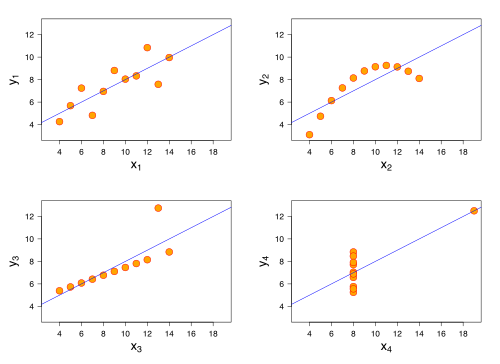

1일차가 **하나의 변수**를 다뤘다면 2일차는 변수가 둘이 된다. 질문도 바뀐다.

- 기온과 아이스크림 판매량 사이에 관계가 있는가? → **상관분석**
- 기온이 1도 오르면 아이스크림은 몇 개 더 팔리는가? → **회귀분석**

두 질문은 비슷해 보이지만 요구하는 것이 다르다. 앞은 **함께 움직이는지**를 묻고, 뒤는 **얼마나 움직이는지**를 묻는다. 그리고 마지막에 세 번째 질문이 남는다. **그 숫자를 믿어도 되는가?** 회귀분석의 가정을 다루는 부분이 여기에 답한다.

1일차와 마찬가지로, 강의자료의 수치는 전부 다시 계산해 확인한 뒤 실었다. 확인 과정에서 정정한 부분은 그 자리에 근거와 함께 적어 뒀다.

## 상관분석

### 산점도부터

두 연속형 변수의 관계를 보는 가장 단순한 방법은 좌표평면에 점을 찍는 것이다. 설명변수를 $x$(가로축), 피설명변수를 $y$(세로축)에 둔다.

관계의 강약은 **세로로 잘라 봤을 때의 흩어짐**으로 판단한다.

```text
[관계가 약함]  중간고사 150점인 학생들의 기말 성적이 75~175점에 분포
               → x를 알아도 y를 좁히지 못한다

[관계가 강함]  중간고사 150점인 학생들의 기말 성적이 125~175점에 분포
               → x를 알면 y의 범위가 좁아진다
```

**관계가 강하다는 것은 곧 예측에 도움이 된다는 뜻**이다. 이 관점은 뒤에서 $R^2$를 이해할 때 그대로 쓰인다.

여기에 1일차의 68-95-99.7 법칙을 겹쳐 보면 산점도가 다르게 보인다. 가로로 보면 점의 약 95%가 $\bar{x} \pm 2SD_x$ 안에 있고, 세로로 보면 약 95%가 $\bar{y} \pm 2SD_y$ 안에 있다. **$x$의 평균·표준편차와 $y$의 평균·표준편차는 각 변수의 분포를 요약할 뿐, 두 변수의 관계는 담지 못한다.**

### 왜 상관분석이 필요한가

이 한계를 보여주는 예가 명확하다. 두 반의 중간·기말 점수 산점도에서 $x$와 $y$의 평균이 모두 5, 표준편차가 모두 2.87로 **완전히 동일한데** 한쪽은 거의 직선에 가깝고 다른 쪽은 흩어져 있다.

```text
기술통계   →  "각 변수"를 설명한다        (중심, 퍼짐, 모양)
상관분석   →  "변수와 변수의 관계"를 설명한다  (방향, 강도)
```


같은 발상을 극단까지 밀어붙인 것이 **앤스컴 콰르텟(Anscombe's quartet)** 이다. 평균·분산·상관계수·회귀직선이 모두 거의 같은데 산점도를 그리면 하나는 직선, 하나는 곡선, 하나는 이상치 하나에 끌려간 직선, 하나는 수직선 형태로 완전히 다르다.

> 그래서 순서가 중요하다. **수치를 먼저 계산하고 그림을 나중에 보는 것이 아니라, 그림을 먼저 보고 수치를 해석해야 한다.** 이 원칙은 뒤에 나올 상관계수 해석의 함정 전부에 적용된다.
{: .prompt-tip }

### 상관계수

두 변수 사이의 **선형** 관계를 하나의 숫자로 표현한 것이 상관계수다.

$$
r = \frac{\displaystyle\sum_{i=1}^{n}(x_i - \bar{x})(y_i - \bar{y}) \big/ (n-1)}{\sqrt{\displaystyle\sum_{i=1}^{n}(x_i - \bar{x})^2 \big/ (n-1)} \cdot \sqrt{\displaystyle\sum_{i=1}^{n}(y_i - \bar{y})^2 \big/ (n-1)}}
= \frac{\text{Cov}(X, Y)}{s_x \cdot s_y}
$$

$$
-1 \le r \le 1
$$

수식을 두 부분으로 나눠 보면 각각이 무슨 일을 하는지 분명해진다.

**분자 — 공분산: 왜 편차를 곱하는가**

$x$의 편차와 $y$의 편차를 곱하는 이유는, **두 변수의 관계가 편차들의 곱에 그대로 반영되기 때문**이다.

| 상황 | $(x_i - \bar{x})$ | $(y_i - \bar{y})$ | 곱 |
|---|:---:|:---:|:---:|
| $x$가 크고 $y$도 크다 | + | + | **양수** |
| $x$가 작고 $y$도 작다 | − | − | **양수** |
| $x$가 크고 $y$는 작다 | + | − | **음수** |

같은 방향으로 움직이면 곱이 양수로 쌓이고, 반대 방향이면 음수로 쌓인다. **부호가 관계의 방향**을 결정한다. 그리고 $x$가 크게 변할 때 $y$도 크게 변하면 곱의 절댓값이 커지므로 **크기가 관계의 강도**를 결정한다.

**분모 — 표준편차로 나누는 이유**

공분산을 그대로 쓰지 않는 이유는 **단위 때문**이다. 키(cm)와 몸무게(kg)의 공분산은 단위가 cm·kg이고, 키를 m로 바꾸면 값이 100분의 1로 변한다. 크기를 비교할 기준이 없다.

각 변수의 표준편차로 나누면 단위가 상쇄되어 **무차원 값**이 되고, 범위가 $-1 \le r \le 1$로 고정된다. 이제 서로 다른 도메인의 상관계수를 비교할 수 있다.

### 자유도가 왜 $n-1$인가

상관계수 공식에 $n-1$이 반복해서 나온다. 1일차에서 미뤄 둔 자유도를 여기서 정리한다.

**자유도(degrees of freedom)** 는 주어진 제약 조건 하에서 자유롭게 정할 수 있는 값의 개수다.

> 세 숫자의 평균이 5로 정해져 있다. 첫 번째가 3, 두 번째가 7이라면 세 번째는?

합이 15여야 하므로 세 번째는 **반드시 5**다. 자유롭게 정할 수 있었던 숫자는 두 개뿐이므로 자유도는 $3 - 1 = 2$다. 편차 $n$개 중 $n-1$개를 알면 나머지 하나는 자동으로 결정된다. 편차의 합이 0이라는 제약이 걸려 있기 때문이다.

$n-1$로 나누는 이유는 **편향 보정**이다. 표본평균 $\bar{x}$는 그 표본에 가장 잘 맞도록 계산된 값이라 편차 제곱합이 실제 모집단 기준보다 작게 나온다. $n$ 대신 $n-1$로 나누면 이 과소추정이 보정되어 **불편추정량**이 된다.

강의에서 든 직관적 설명이 좋았다. 관측치가 **1개**일 때를 생각해 보자.

```text
n으로 나누면:    편차 = 0,  0/1 = 0  →  표준편차 0
                "값이 하나뿐인데 불확실성이 0이다"?

n-1로 나누면:   0/(1-1) = 0/0  →  부정형(indeterminate)
                "알 수 없다"
```

올해 수익률이 10%라는 관측 하나로 내년도 10%가 확실하다고 말할 수는 없다. **표준편차로 알고 싶은 것은 얼마나 불확실한가인데, 데이터가 하나뿐이면 불확실성을 알 수 없다는 것이 정직한 답**이다. 자유도를 쓰면 그 답이 "0"이 아니라 "정의되지 않음"으로 나온다.

### 해석의 가이드라인

| $\lvert r \rvert$ | 해석 |
|---|---|
| 0.0 ~ 0.2 | 거의 상관 없음 |
| 0.2 ~ 0.4 | 약한 상관 |
| 0.4 ~ 0.6 | 중간 정도 상관 |
| 0.6 ~ 0.8 | 강한 상관 |
| 0.8 ~ 1.0 | 매우 강한 상관 |

이 구간은 **경험적·관습적 기준**이지 이론적 근거가 있는 값이 아니다. 물리 실험에서 $r = 0.7$은 실망스러운 값이지만, 사람의 행동을 다루는 사회과학에서 $r = 0.4$는 충분히 의미 있는 발견이다. **도메인에 따라 기준이 달라진다는 점을 전제로 써야 한다.**

$r = 1$ 또는 $r = -1$인 **완전상관**은 모든 점이 정확히 하나의 직선 위에 있는 경우다.

### 상관계수 해석의 함정

숫자만 보고 기계적으로 해석하면 틀리는 상황이 여럿 있다.

#### ① 이상치

강의 사례가 인상적이었다. 키-체중 데이터 7개에서 키 210cm·체중 61kg인 한 점이 섞여 있을 때와 없을 때를 비교하면:

| | 데이터 수 | 상관계수 |
|---|---|---|
| 이상치 포함 | 7 | $r = 0.339$ |
| 이상치 제거 | 6 | $r = 0.857$ |

**점 하나가 "약한 상관"을 "매우 강한 상관"으로 바꾼다.** 상관계수는 평균과 마찬가지로 이상치에 민감하다.

여기서 주의할 점이 있다. 이상치를 지우면 상관이 올라간다고 해서 **지우는 것이 항상 옳은 것은 아니다.** 측정 오류나 입력 실수라면 제거가 맞지만, 실제로 존재하는 극단 사례라면 제거는 데이터 조작에 가깝다. 판단이 어려우면 **제거 전후를 모두 보고하는 것**이 정직한 처리다.

#### ② 비선형 관계

상관계수는 **선형** 관계만 잰다. 포물선 형태의 완벽한 관계가 있어도 $r$은 0에 가깝게 나올 수 있다.

```text
r ≈ 0 이 뜻하는 것:  "선형 관계가 없다"
r ≈ 0 이 뜻하지 않는 것: "아무 관계가 없다"
```

상관계수는 **산점도가 타원형일 때** 관계를 잘 설명한다. 타원이 아니면(이상치가 있거나 곡선이면) 유용성이 떨어진다. 그래서 앞서 말한 대로 그림을 먼저 봐야 한다.

#### ③ 평균화 효과

개별 데이터로 계산한 상관계수와 그룹 평균으로 계산한 상관계수가 크게 다를 수 있다. 강의 예시에서 교육수준과 소득의 상관은 개인 단위로 $r = 0.34$였지만, 지역별 평균으로 묶으니 $r = 0.94$로 뛰었다.

이유는 단순하다. **평균을 내는 과정에서 개인차라는 잡음이 상쇄되기 때문**이다. 점의 개수가 줄고 흩어짐이 사라지니 직선에 가까워 보인다.

문제는 이렇게 얻은 강한 상관을 개인 수준의 주장으로 옮길 때 생긴다. **"지역 평균 교육연수가 높으면 지역 평균 소득이 높다"** 와 **"교육을 더 받은 사람이 소득이 높다"** 는 다른 명제다. 앞의 것으로 뒤의 것을 주장하는 오류를 **생태학적 오류(ecological fallacy)** 라 하고, 1일차의 심슨의 역설과 같은 뿌리다.

#### ④ 허구적 상관 (Spurious Correlation)

강의에서 든 예는 다우존스 지수와 배우 제니퍼 로렌스의 미디어 언급 횟수다. 2014년 한 해 동안 두 시계열의 상관계수가 **0.86**이었다. 그렇다면 그 배우의 언급이 늘 때 다우존스에 투자해야 할까?

당연히 아니다. 두 계열 모두 **그해에 우연히 상승 추세를 보였을 뿐**이다.

이건 시계열 데이터에서 구조적으로 발생하는 문제다. **추세를 가진 두 계열은 내용과 무관하게 상관이 높게 나온다.** 한국의 연간 GDP와 남태평양 어느 섬의 연간 강수 누적량을 붙여도 둘 다 우상향이면 상관이 높다.

> 시계열끼리 상관을 볼 때는 원계열이 아니라 **차분(전기 대비 변화량)** 이나 추세 제거 후의 값으로 봐야 한다. 이 처리를 건너뛰고 회귀까지 돌리면 **허구적 회귀(spurious regression)** 가 되어 $R^2$와 t통계량이 모두 그럴듯하게 나오는데 아무 의미가 없다.
{: .prompt-warning }

### 상관관계와 인과관계

앞의 모든 함정이 하나의 명제로 수렴한다.

> **Correlation does not imply Causality.**
{: .prompt-danger }

인과관계가 성립하려면 세 조건이 필요하다.

| 조건 | 의미 |
|---|---|
| **시간적 선행성** | 원인이 결과보다 먼저 발생해야 한다 |
| **공변성** | $X$가 변하면 $Y$도 함께 변해야 한다 |
| **교란변수의 배제** | $X$와 $Y$를 동시에 설명하는 제3의 원인이 없어야 한다 |

상관분석이 확인해 주는 것은 **두 번째뿐**이다. 상관계수가 아무리 높아도

- 우연일 수 있고 (허구적 상관)
- 숨은 교란변수가 있을 수 있고 (아이스크림 판매와 익사 사고 — 공통 원인은 기온)
- **인과의 방향이 반대일 수 있다** (운동을 해서 건강한 것인가, 건강해서 운동할 수 있는 것인가)

**상관분석은 "함께 변하는가"를 알려줄 뿐 "왜 변하는가"는 알려주지 않는다.** 1일차에서 실험과 관측을 구분했던 이유가 여기 있다. 무작위 배정이 가능한 실험에서는 교란변수가 평균적으로 상쇄되지만, 관측 데이터에서는 그럴 수 없다.

## 회귀분석

### 가장 단순한 예측에서 출발하기

키(x)로 몸무게(y)를 예측한다고 하자. 아무 정보도 쓰지 않는다면 가장 합리적인 예측은 **전체 평균**이다. 산점도 위에 수평선 하나를 긋는 것과 같다.

그런데 우리는 키를 안다. 키가 176cm인 사람들만 세로로 잘라 보면 그 안에서도 몸무게가 흩어져 있지만, **그 집단의 평균**은 전체 평균과 다르다.

키 값마다 이 작업을 반복해 각 집단의 평균을 점으로 찍으면 우상향하는 점들의 열이 나온다. **이 점들을 하나의 직선으로 근사한 것이 회귀직선**이다.

> 회귀분석은 **각각의 $x$ 값에 대응하는 $y$의 평균을 추정하는 방법**이고, 회귀직선은 그 평균들의 그래프를 직선으로 근사한 것이다.
{: .prompt-info }

이 정의를 정확히 잡아 두면 두 가지가 자연스럽게 따라온다. 첫째, 회귀는 개별 값이 아니라 **조건부 평균** $E[Y \mid X]$을 예측한다. 둘째, **평균들의 그래프가 곡선이라면 직선 근사는 부적절하다.** 뒤에 나올 선형성 가정이 여기서 예고된다.

### 좋은 직선의 기준

직선은 무수히 그을 수 있다. 어느 것이 좋은가?

기준은 **데이터와 직선 사이의 거리, 즉 잔차(Residual)** 다. 잔차의 합이 작을수록 좋은 직선이다.

$$
\text{잔차} = \text{실제값} - \text{예측값} = y_i - \hat{y}_i
$$

그런데 잔차를 그냥 더하면 안 된다. 양수와 음수가 상쇄되어 엉뚱한 직선도 합이 0이 나올 수 있다. 그래서 **제곱해서 더한다.**

$$
\min_{\beta_0, \beta_1} \sum_{i=1}^{n}\left(y_i - \beta_0 - \beta_1 x_i\right)^2
$$

이것이 **최소제곱법(Least Squares Method)**, 전형적인 회귀 가정 하에서 쓰일 때 **OLS(Ordinary Least Squares)** 다.

**왜 하필 제곱인가?**

- 부호 상쇄를 막는다
- **큰 오차에 더 큰 패널티**를 준다 (오차 2 → 4, 오차 5 → 25)
- 미분이 쉽다 ($x^2 \to 2x$)
- 제곱함수는 아래로 볼록해서 **해가 항상 유일하다**

간단한 예로 확인해 보면 감이 온다. 데이터가 A(1,1), B(2,2), C(3,3)일 때 세 직선을 비교하면:

| 직선 | 예측값 | 잔차 제곱합 |
|---|---|---|
| $y = 2x$ | 2, 4, 6 | $1 + 4 + 9 = 14$ |
| $y = x + 2$ | 3, 4, 5 | $4 + 4 + 4 = 12$ |
| $y = x$ | 1, 2, 3 | $0 + 0 + 0 = \mathbf{0}$ |

세 번째가 잔차 제곱합을 최소로 만드는 직선이다.

> 절댓값을 쓰는 방법도 있다(**LAD 회귀**, 최소절대편차). 이쪽은 이상치에 강건하다는 장점이 있지만 미분 불가능한 지점이 있어 해를 구하기 번거롭고 해가 유일하지 않을 수 있다. 제곱을 표준으로 쓰는 이유는 수학적 편의가 크다.
{: .prompt-tip }

최소화 문제를 풀면 추정량이 닫힌 형태로 나온다.

$$
\hat{\beta}_1 = \frac{\sum(x_i - \bar{x})(y_i - \bar{y})}{\sum(x_i - \bar{x})^2} = \frac{\text{Cov}(X, Y)}{\text{Var}(X)}
\qquad
\hat{\beta}_0 = \bar{y} - \hat{\beta}_1\bar{x}
$$

절편 공식이 말해 주는 사실이 하나 있다. **회귀직선은 반드시 평균점 $(\bar{x}, \bar{y})$을 지난다.**

### 행렬로 보는 OLS — NumPy는 왜 역행렬을 쓰지 않는가

변수가 하나면 위의 닫힌 공식으로 충분하지만, 변수가 여러 개가 되면 행렬로 쓰는 편이 낫다. 설계행렬 $X \in \mathbb{R}^{n \times p}$(첫 열은 절편용 1)과 반응벡터 $y$에 대해 문제는 이렇게 바뀐다.

$$
\hat{\beta} = \arg\min_{\beta} \lVert y - X\beta \rVert_2^2
$$

미분해서 0으로 놓으면 **정규방정식(normal equation)** 이 나온다.

$$
X^\top X \hat{\beta} = X^\top y
\quad\Longrightarrow\quad
\hat{\beta} = (X^\top X)^{-1} X^\top y
$$

교과서에 이 형태로 실려 있어서 코드도 그렇게 쓰기 쉬운데, **수치적으로는 이렇게 계산하면 안 된다.** 이유는 조건수(condition number)에 있다.

$$
\kappa(X^\top X) = \kappa(X)^2
$$

$X^\top X$를 만드는 순간 조건수가 **제곱**되고, 유효자릿수가 그만큼 날아간다. 직접 확인해 보면 근사가 아니라 등식이다.

```python
import numpy as np
n = 200
x = np.linspace(0, 1, n)
X = np.vstack([np.ones(n), x, x**2, x**3, x**4, x**5]).T   # 악조건 설계행렬

np.linalg.cond(X)        # 3.7769e+03
np.linalg.cond(X.T @ X)  # 1.4265e+07  == cond(X)**2 (비율 1.000000)
```

노이즈 없이 정확히 복원 가능한 데이터를 넣고 계수를 되찾게 해 보면 차이가 드러난다.

| 방법 | 최대 오차 |
|---|---|
| `inv(X.T @ X) @ X.T @ y` | $6.4 \times 10^{-10}$ |
| `solve(X.T @ X, X.T @ y)` | $7.1 \times 10^{-10}$ |
| `np.linalg.lstsq(X, y)` | $\mathbf{1.4 \times 10^{-13}}$ |

`lstsq`가 세 자릿수 이상 정확하다. 이 함수가 정규방정식을 피하고 **SVD로 직접 푸는** 덕분이다.

#### SVD로 최소제곱해를 유도하기

$X = U \Sigma V^\top$로 분해한다($U, V$는 직교, $\Sigma$는 특이값 대각). 직교행렬은 노름을 보존하므로 목적함수를 이렇게 바꿔 쓸 수 있다.

$$
\lVert y - X\beta \rVert^2
= \lVert U^\top y - \Sigma V^\top \beta \rVert^2
$$

$z = V^\top \beta$, $c = U^\top y$로 두면 좌표별로 분리된 문제가 된다.

$$
\lVert c - \Sigma z \rVert^2 = \sum_{i}\left(c_i - \sigma_i z_i\right)^2
$$

각 항이 독립이므로 $\sigma_i \neq 0$인 좌표에서는 $z_i = c_i / \sigma_i$가 유일한 최소값이고, $\sigma_i = 0$인 좌표는 목적함수에 **아무 영향을 주지 않는다.** 그 자유도를 $z_i = 0$으로 두면 $\lVert \beta \rVert$가 최소가 된다. 정리하면

$$
\hat{\beta} = V \Sigma^{+} U^\top y = X^{+} y
$$

여기서 $\Sigma^{+}$는 0이 아닌 특이값만 역수를 취한 유사역행렬이다. 실제로 세 경로가 같은 값을 준다.

```python
U, s, Vt = np.linalg.svd(X, full_matrices=False)
b_svd = Vt.T @ ((U.T @ y) / s)      # V Σ⁺ Uᵀ y

np.max(np.abs(b_svd - np.linalg.lstsq(X, y, rcond=None)[0]))  # 8.9e-16
np.max(np.abs(np.linalg.pinv(X) @ y - b_svd))                  # 8.9e-16
```

#### 공선성이 완전할 때 갈라지는 지점

이 유도의 값어치는 $X^\top X$가 **역행렬을 갖지 않을 때** 드러난다. $x_2 = 2x_1$인 설계행렬을 넣어 보면:

```python
X = np.column_stack([np.ones(n), x1, 2*x1])   # rank 2 (열은 3개)

np.linalg.inv(X.T @ X) @ X.T @ y   # [2.962, -0.162,  0.653]  예외 없이 반환
np.linalg.lstsq(X, y, rcond=None)  # [2.989,  0.399,  0.798], rank=2
```

진짜 계수가 $y = 3 + 2x_1$일 때 $x_1$에 대한 **총 효과**를 보면 판정이 갈린다. `lstsq`는 $0.399 + 2(0.798) = 1.995 \approx 2$로 맞지만, 정규방정식은 $-0.162 + 2(0.653) = 1.144$로 틀렸다. **더 위험한 건 예외가 나지 않는다는 점이다.** 특이행렬의 역행렬을 부동소수점으로 흉내 내면서 조용히 쓰레기값을 반환한다.

SVD는 특이값을 `[13.95, 7.06, 0.0]`으로 내놓아 **랭크가 2라는 사실을 스스로 보고**하고, 무한히 많은 최적해 중 노름이 가장 작은 것을 고른다. 위 예에서 $\lVert \hat{\beta} \rVert = 3.119$인데, 적합값이 완전히 동일한 다른 해를 만들어 보면 $3.838$로 더 크다.

> `np.linalg.lstsq`의 `rcond`가 바로 이 판정 임계값이다. `rcond * max(s)`보다 작은 특이값을 0으로 간주해 랭크를 정한다. `np.polynomial.polynomial.polyfit`도 내부에서 `lstsq`를 호출하므로 같은 성질을 물려받는다.
{: .prompt-tip }

> 학부 머신러닝 수업에 조교로 들어가면서 데이터분석 실습 코드를 가르친 적이 있는데, 이 지점이 매번 걸렸다. 수식을 그대로 옮겨 `inv(X.T @ X) @ X.T @ y`로 쓴 코드가 압도적으로 많았고, 데이터가 얌전할 때는 잘 돌아가니 문제를 못 느낀다. 그러다 더미변수를 전부 넣어 **더미 변수 함정**에 빠지거나 다항 특성을 고차까지 올리면 그때 결과가 무너지는데, 원인을 찾기가 어렵다. 에러가 아니라 **그럴듯한 숫자**가 나오기 때문이다. 그래서 실습에서는 항상 `lstsq`나 `pinv`를 기본으로 쓰게 하고, 정규방정식은 "유도 과정에만 등장하는 식"으로 선을 그었다.
{: .prompt-info }

뒤에 나올 **다중공선성** 논의가 이 이야기의 통계 쪽 판본이다. 완전 공선성이 아니라 근사적 공선성이면 $X^\top X$는 역행렬을 갖긴 하지만 조건수가 커지고, 그 결과가 계수 표준오차의 폭증으로 나타난다.

### 회귀직선과 상관계수의 만남

이 절이 2일차에서 가장 잘 짜인 부분이었다.

> 평균키가 167.5cm(SD 8.5), 평균 몸무게가 63.5kg(SD 11.9)인 집단에서 키가 176cm인 사람의 몸무게는?

176cm는 평균보다 정확히 **1 표준편차** 큰 값이다. 그러면 몸무게도 평균보다 1 표준편차 큰 값, 즉 $63.5 + 11.9 = 75.4$kg일까?

**아니다.** 그건 상관계수가 1일 때, 즉 모든 점이 직선 위에 있을 때만 맞다. 실제 상관계수가 $r = 0.67$이므로 $y$는 **$r$배만큼만 반응한다.**

$$
\hat{y} = \bar{y} + r \cdot SD_y = 63.5 + 0.67 \times 11.9 = 63.5 + 7.97 \approx 71.5\ \text{kg}
$$

75.4kg이 아니라 71.5kg이다. 여기서 회귀직선의 기울기가 나온다.

$$
b = r\,\frac{SD_y}{SD_x}
$$

확인해 보면 $b = 0.67 \times \frac{11.9}{8.5} = 0.938$이고, $\hat{y} = 63.5 + 0.938 \times (176 - 167.5) = 71.5$로 같은 값이 나온다.

**상관계수 $r$은 "$X$가 1 표준편차 움직일 때 $Y$가 몇 표준편차 따라갈지"를 결정하는 비율**이다.

| $r$ | $x$가 $+1SD$일 때 $y$의 변화 |
|---|---|
| $r = 1$ | $+1SD$ (완전히 따라감) |
| $r = 0.5$ | $+0.5SD$ (절반만 따라감) |
| $r = 0$ | $0$ (움직이지 않음, 예측값은 항상 $\bar{y}$) |

$r = 0$일 때 예측값이 전체 평균이 된다는 점을 보라. **정보가 없으면 평균으로 예측한다**는 처음의 출발점으로 돌아온다.

### 회귀효과: 평균으로의 회귀

위 계산이 함의하는 현상이 있다.

> 중간고사에서 평소보다 잘 본 학생들은 기말고사에서도 똑같이 잘 볼까?

$r < 1$인 한 예측값은 항상 평균 쪽으로 당겨진다. 중간고사에서 $+2SD$였던 학생의 기말 예측값은 $+2SD$가 아니라 $+2r \cdot SD$다. $r = 0.5$라면 $+1SD$로 줄어든다.

이것이 **평균으로의 회귀(Regression to the mean)** 이고, '회귀분석'이라는 이름 자체가 여기서 유래했다.

원인은 신비롭지 않다. **극단적인 관측값에는 일시적 요인(운, 컨디션, 실수, 특이한 상황)이 섞여 있을 가능성이 크고, 다시 측정하면 그 요인이 사라지기 때문**이다.

> 강의자료는 이 관계를 "상관계수가 0에 가까울수록 ($\lvert r \rvert < 0$) 예측값이 평균으로 더 강하게 끌어당겨진다"고 적었는데, **절댓값은 항상 0 이상이므로 $\lvert r \rvert < 0$인 경우는 존재하지 않는다.** 문맥상 "$\lvert r \rvert$이 작을수록", 즉 $\lvert r \rvert \to 0$을 의도한 표기로 보여 그렇게 고쳐 적었다.
{: .prompt-warning }

이 현상은 실무에서 자주 잘못 해석된다. 성과가 나쁜 지점에 컨설팅을 투입했더니 다음 분기에 좋아졌다면, 그건 컨설팅 효과일 수도 있지만 **애초에 극단적으로 나빴던 값이 평균으로 돌아온 것**일 수도 있다. 대조군 없이는 구분할 수 없다.

### 회귀모형의 평가

#### RMSE

$$
RMSE = \sqrt{\frac{1}{n}\sum_{i=1}^{n}(\hat{y}_i - y_i)^2}
$$

실제값과 예측값의 평균적인 차이, 즉 **잔차의 전형적인 크기**를 잰다. MSE에 제곱근을 취해 $y$와 단위를 맞췄기 때문에 "평균적으로 몇 kg쯤 틀린다"처럼 바로 해석된다.

RMSE는 1일차의 68-95-99.7 법칙과 결합해 예측 구간으로 읽을 수도 있다. 잔차가 정규분포를 따른다면:

```text
회귀직선 ± 1×RMSE   →  약 68%의 관측치가 이 띠 안에
회귀직선 ± 2×RMSE   →  약 95%의 관측치가 이 띠 안에
```

즉 회귀직선은 **띠의 중심선**이고 RMSE는 **띠의 두께**다.

#### 확인해 보니: RMSE와 엑셀의 "표준 오차"는 같은 값이 아니다

강의자료는 RMSE를 "추정의 표준오차(standard error of estimate)라고도 불린다"고 설명하고, 뒤의 엑셀 회귀분석 출력에서 **표준 오차 27.565**를 그 값으로 제시했다. 이 둘이 정말 같은지 검산해 봤다.

슬라이드에 제시된 제곱합은 다음과 같다. 관측수 $n = 15$, 독립변수 2개.

$$
SSE = 9{,}117.708, \qquad df_{\text{잔차}} = n - k - 1 = 15 - 2 - 1 = 12
$$

두 방식으로 계산하면:

$$
\underbrace{\sqrt{\frac{SSE}{n}} = \sqrt{\frac{9117.708}{15}} = 24.655}_{\text{슬라이드의 RMSE 정의}(1/n)}
\qquad
\underbrace{\sqrt{\frac{SSE}{n-k-1}} = \sqrt{\frac{9117.708}{12}} = \mathbf{27.565}}_{\text{엑셀 출력의 표준 오차}}
$$

**엑셀의 27.565와 일치하는 것은 뒤쪽이다.** 즉 회귀의 표준오차는 $n$이 아니라 **잔차 자유도로 나눈다.**

$$
s = \sqrt{\frac{SSE}{n - k - 1}}
$$

이유는 상관계수에서 $n-1$을 쓴 것과 같다. 회귀직선은 데이터에 맞춰 계수 $k+1$개를 추정한 결과이므로, 잔차는 그만큼 실제보다 작게 나온다. 자유도로 나누는 것이 **불편추정**이다.

머신러닝에서 예측 성능 지표로 쓰는 RMSE는 보통 $1/n$을 쓰고, 통계학의 회귀 표준오차는 자유도를 쓴다. **표본이 작고 변수가 많을수록 둘의 차이가 커진다.** 이 예제에서도 24.655와 27.565로 12% 정도 차이가 난다.

#### 결정계수 $R^2$

$$
R^2 = \frac{SSR}{SST} = 1 - \frac{SSE}{SST}
$$

| 기호 | 이름 | 의미 |
|---|---|---|
| $SST$ | 총변동 | $y$가 자기 평균에서 벗어난 전체 크기 |
| $SSR$ | 회귀변동 | 그중 **회귀선이 설명한** 부분 |
| $SSE$ | 잔차변동 | 그중 **설명하지 못한** 부분 |

$R^2 = 0.6$이면 "종속변수 변동의 60%를 이 모형이 설명한다"는 뜻이다. 0에서 1 사이이고 높을수록 적합이 좋다.

여기서 앞의 산점도 이야기와 연결된다. 세로로 잘랐을 때 흩어짐이 작다 = 잔차가 작다 = $SSE$가 작다 = $R^2$가 크다. **관계가 강하면 예측에 도움이 된다**는 직관이 $R^2$라는 숫자로 표현된 것이다.

**조정된 결정계수(Adjusted $R^2$)** 가 필요한 이유도 분명하다. $R^2$는 **의미 없는 변수를 넣어도 절대 감소하지 않는다.** 변수를 늘리면 무조건 올라가므로 모형 비교 기준으로 쓸 수 없다. 조정된 $R^2$는 변수 개수에 대한 벌점을 넣어 이를 보정한다.

$$
R^2_{adj} = 1 - (1 - R^2)\frac{n-1}{n-k-1}
$$

**변수가 여러 개인 모형을 비교할 때는 조정된 $R^2$를 본다.**

#### $SST = SSR + SSE$는 공짜가 아니다

위에서 $R^2$를 $\frac{SSR}{SST}$와 $1 - \frac{SSE}{SST}$ 두 가지로 적었다. 이 둘이 같으려면 **총변동이 정확히 둘로 쪼개져야** 한다.

$$
\underbrace{\sum (y_i - \bar{y})^2}_{SST} = \underbrace{\sum (\hat{y}_i - \bar{y})^2}_{SSR} + \underbrace{\sum (y_i - \hat{y}_i)^2}_{SSE}
$$

그런데 $y_i - \bar{y} = (\hat{y}_i - \bar{y}) + (y_i - \hat{y}_i)$를 그냥 제곱하면 교차항이 남는다.

$$
SST = SSR + SSE + \underbrace{2\sum (\hat{y}_i - \bar{y})(y_i - \hat{y}_i)}_{\text{교차항}}
$$

**등식이 성립하는 것은 이 교차항이 0일 때뿐이다.** 잔차를 $e = y - \hat{y}$라 두면 교차항은 $2(\hat{y} - \bar{y}\mathbf{1})^\top e$이고, 이것이 사라지려면 두 조건이 모두 필요하다.

| 조건 | 의미 | 어디서 나오나 |
|---|---|---|
| $\hat{y}^\top e = 0$ | 적합값과 잔차가 직교 | 정규방정식 $X^\top e = 0$ |
| $\mathbf{1}^\top e = 0$ | 잔차의 합이 0 | 설계행렬에 **절편 열**이 있어야 함 |

즉 이 분해는 항등식이 아니라 **OLS + 절편**이라는 조건 위에서만 성립하는 **직교분해**다. 기하로 보면 $\hat{y}$는 $y$를 $X$의 열공간에 정사영한 점이고, $e$는 그 공간과 수직인 성분이다. 그래서 피타고라스 정리가 그대로 적용된다.

절편을 빼고 원점을 지나도록 강제하면 바로 깨진다.

```python
X0 = x.reshape(-1, 1)                       # 절편 열 없음
b0 = np.linalg.lstsq(X0, y, rcond=None)[0]
yh0 = X0 @ b0
```

| | 절편 있음 | 절편 없음 |
|---|---:|---:|
| $SST$ | 321.03 | 321.03 |
| $SSR + SSE$ | 321.03 | **679.61** |
| 교차항 | $-3.2 \times 10^{-13}$ | $\mathbf{-358.58}$ |
| $\sum e_i$ | $-1.5 \times 10^{-13}$ | $\mathbf{+19.07}$ |
| $R^2 = SSR/SST$ | 0.6013 | **1.4988** |
| $R^2 = 1 - SSE/SST$ | 0.6013 | **0.3819** |

절편이 빠지자 두 정의가 **0.38과 1.50으로 갈라지고**, 한쪽은 1을 넘어 버린다. 소프트웨어마다 무절편 회귀의 $R^2$를 다르게 계산하는 이유가 여기 있다. **무절편 모형의 $R^2$는 절편 모형의 $R^2$와 비교하면 안 된다.**

> 표기에 주의할 점이 있다. 이 글은 $SSR$을 회귀변동(regression), $SSE$를 잔차변동(error)으로 쓴다. 반대로 $SSE$를 explained, $SSR$을 residual로 쓰는 교재도 있어서 문헌을 넘나들 때 부호가 뒤집힌 것처럼 보일 수 있다. 이름보다 **무엇을 무엇에서 뺀 제곱합인지**를 확인하는 편이 안전하다.
{: .prompt-warning }

#### $R^2$가 음수로 나오는 경우

$R^2$를 "0에서 1 사이"라고 외우면 음수를 만났을 때 계산이 틀렸다고 생각하기 쉽다. 그렇지 않다. 정의를 다시 보면

$$
R^2 = 1 - \frac{SSE}{SST}
$$

여기서 $SST$는 **$\bar{y}$로 예측했을 때의 오차제곱합**이다. 그러니 이 식은 "내 모형이 평균이라는 기준선보다 얼마나 나은가"를 재는 상대 지표이고, $SSE > SST$이면 값은 자연스럽게 음수가 된다. 뜻은 명확하다 — **그냥 평균을 답하는 것보다 못하다.**

$R^2$가 $[0, 1]$에 갇히는 것은 **절편이 있는 OLS를 훈련한 그 데이터에서 평가할 때**뿐이다. 그 조건이 깨지는 상황이 실제로는 흔하다.

| 상황 | 왜 음수가 되나 |
|---|---|
| **검증/테스트셋 평가** | 계수를 훈련셋에서 정했으므로 검증셋에서 직교성이 보장되지 않는다 |
| **무절편 모형** | $\sum e_i \neq 0$ |
| **정규화 회귀 (Ridge/Lasso)** | 잔차제곱합을 최소화하지 않으므로 최적해가 아니다 |
| **다른 모형·다른 시점의 예측값** | 애초에 이 데이터에 적합시킨 값이 아니다 |

과적합이 만드는 음수 $R^2$는 규모가 상당하다. 표본 12개에 9차 다항을 맞추면:

| 모형 | 훈련 $R^2$ | 검증 $R^2$ |
|---|---:|---:|
| 1차 | +0.9479 | +0.7432 |
| 3차 | +0.9642 | +0.7701 |
| 9차 | +0.9943 | $\mathbf{-9147.28}$ |

훈련 $R^2$는 0.99를 넘기며 계속 좋아지는데 검증 $R^2$는 네 자릿수 음수로 무너진다. 앞서 "$R^2$는 변수를 넣으면 무조건 오른다"고 한 성질의 대가를 검증셋이 대신 치르는 셈이다.

> 그래서 음수 $R^2$는 버그 신호가 아니라 **진단 정보**다. 값이 음수라는 것은 "이 모형은 쓸 수 없다"가 아니라 "**평균이라는 가장 게으른 기준선에도 지고 있다**"는 구체적인 정보를 준다. 검증셋 $R^2$가 음수라면 모형을 손보기 전에 먼저 훈련/검증 분포가 어긋났는지, 변수 개수가 표본 수에 비해 과한지를 본다.
{: .prompt-tip }

### 회귀 결과 읽기

강의 예제는 쿠폰 배포 매수($x_1$)와 판매가격($x_2$)으로 구매 고객수($y$)를 설명하는 문제였다. 엑셀 회귀분석 출력을 어떻게 읽는지가 실질적인 내용이라 **모든 통계량을 직접 재계산해 확인**했다.

**1차 모형 (변수 2개)**

$$
y = 0.109x_1 + 0.003x_2 + 274.375
$$

| 항목 | 슬라이드 값 | 검산 | 확인 |
|---|---|---|---|
| 결정계수 $R^2 = SSR/SST$ | 0.773 | $30983.225 / 40100.933 = 0.7726$ | ✓ |
| 조정된 $R^2$ | 0.735 | $1 - 0.2274 \times \frac{14}{12} = 0.7347$ | ✓ |
| 다중상관계수 $\sqrt{R^2}$ | 0.879 | $\sqrt{0.7726} = 0.8790$ | ✓ |
| 표준 오차 $\sqrt{SSE/df}$ | 27.565 | $\sqrt{9117.708/12} = 27.565$ | ✓ |
| $F$비 $= MSR/MSE$ | 20.389 | $15491.61 / 759.809 = 20.389$ | ✓ |

출력이 내부적으로 완전히 일관됐다. 이제 세 블록을 읽는다.

**① 모델의 적합성**

- 조정된 $R^2$ = 0.735 → 전체 변동의 약 73.5%를 설명
- 표준 오차 = 27.565 → 예측이 평균적으로 ±27.6명 정도 틀린다

**② ANOVA 표 — 모형 전체가 유의한가**

유의한 F가 0.000이므로 **회귀모형 자체는 통계적으로 유의**하다. $F$검정의 귀무가설은 "모든 회귀계수가 0이다"이므로, 이를 기각했다는 것은 **적어도 하나의 변수는 의미가 있다**는 뜻이다. 1일차 ANOVA의 대립가설과 같은 구조다.

**③ 계수 표 — 어떤 변수가 유의한가**

| 변수 | 계수 | t통계량 | p-value | 판정 |
|---|---|---|---|---|
| Y절편 | 274.375 | 6.043 | 0.0000582 | 유의 |
| 쿠폰배포매수 | 0.109 | 6.326 | 0.0000380 | **유의** |
| 판매가격 | 0.003 | 0.242 | 0.813 | **유의하지 않음** |

판매가격의 p-value가 0.813으로 매우 크다. 변수를 제거하고 재적합한다.

**2차 모형 (변수 1개)**

$$
y = 0.108x_1 + 282.892
$$

| 항목 | 슬라이드 값 | 검산 |
|---|---|---|
| $R^2$ | 0.749 | $30047.056/40100.933 = 0.7493$ ✓ |
| 조정된 $R^2$ | 0.730 | $1 - 0.2507 \times \frac{14}{13} = 0.7300$ ✓ |
| 표준 오차 | 27.810 | $\sqrt{10053.877/13} = 27.810$ ✓ |
| $F$비 | 38.852 | $30047.056/773.375 = 38.852$ ✓ |
| $t$ (쿠폰) | 6.233 | $0.108/0.017328 = 6.233$ ✓ |

여기서 확인해 볼 만한 항등식이 하나 있다. **단순회귀(독립변수 1개)에서는 $F = t^2$가 성립한다.**

$$
t^2 = 6.233^2 = 38.85 \approx F = 38.852 \quad \checkmark
$$

변수가 하나뿐이면 "모형 전체가 유의한가(F)"와 "이 변수가 유의한가(t)"가 같은 질문이 되므로 당연한 결과다. 출력을 읽을 때 값이 제대로 나왔는지 빠르게 점검하는 데 쓸 수 있다.

**해석**

- 쿠폰 배포 매수는 구매 고객수에 유의한 영향을 미친다
- 다른 조건이 같다면 쿠폰을 **10장 추가 배포할 때 구매 고객수는 평균 약 1.08명 증가**한다 ($0.108 \times 10$)
- 이 모형은 구매 고객수 변동의 약 73%를 설명한다

#### 확인해 보니: 두 가지를 덧붙여야 한다

**① "3,000장 배포 시 약 607명"은 외삽이다**

슬라이드는 $0.108 \times 3000 + 282.892 \approx 607$명이라는 예측을 제시했다. 계산은 맞다. 그런데 이 예측을 그대로 쓰기는 어렵다.

관측수는 **15개**뿐이고, 절편이 282.9인 점을 보면 원 데이터의 쿠폰 배포 매수 범위는 3,000장보다 훨씬 작았을 가능성이 크다. **회귀모형은 관측된 $x$의 범위 안에서만 신뢰할 수 있다.** 범위 밖으로 직선을 연장하는 것을 외삽(extrapolation)이라 하고, 이때 선형 관계가 계속 유지된다는 보장은 어디에도 없다.

현실적으로도 쿠폰을 무한정 뿌린다고 고객이 비례해서 늘 리 없다. 어느 지점에서 포화되거나 오히려 브랜드 가치가 떨어질 수 있다. **실제 데이터가 보여준 것은 직선이지만, 그 직선이 데이터 밖에서도 직선이라는 근거는 데이터에 없다.**

**② "유의하지 않다"는 "효과가 없다"가 아니다**

판매가격을 제거한 판단 자체는 합리적이다. 다만 결론을 적을 때 표현에 주의해야 한다.

```text
p = 0.813 이 뜻하는 것:      "가격의 효과가 있다는 증거가 부족하다"
p = 0.813 이 뜻하지 않는 것:  "가격은 고객수에 영향이 없다"
```

1일차의 2종 오류와 검정력이 여기서 쓰인다. **관측수가 15개면 검정력이 낮아 실재하는 효과도 잡아내지 못할 수 있다.** 게다가 뒤에 나올 다중공선성이 있으면 중요한 변수조차 유의하지 않게 나온다.

슬라이드도 "변수 제거 후 모형 재개발 **검토**"라고 신중하게 적어 뒀는데, 이 신중함이 표현에 그치지 않으려면 근거를 함께 적는 편이 낫다고 보고 위 내용을 덧붙였다.

### 회귀 결과를 읽는 다섯 가지 질문

출력에서 무엇을 봐야 하는지 순서를 정리하면 이렇다.

| 질문 | 지표 |
|---|---|
| 모델이 데이터를 얼마나 잘 설명하는가? | $R^2$, 조정된 $R^2$ |
| 어떤 변수가 실제로 영향을 미치는가? | p-value |
| 변수의 영향력과 방향은? | 회귀계수 (부호와 크기) |
| 평균적으로 얼마나 틀리는가? | 표준 오차 (RMSE) |
| 모델 전체가 유의한가? | $F$검정 |

## 선형모형의 가정

### 결과가 나왔다고 믿을 수 있는 건 아니다

회귀분석을 실행하면 회귀식, $R^2$, 회귀계수, p-value가 전부 계산된다. **버튼만 누르면 숫자는 무조건 나온다.** 문제는 그 숫자를 믿어도 되는지다.

가정이 충족되지 않으면 이런 일이 생긴다.

- 회귀계수의 크기와 방향을 해석하기 어려워진다
- **표준오차와 p-value를 신뢰할 수 없다** (유의성 판단이 통째로 흔들린다)
- 새로운 데이터에 대한 예측 성능이 떨어진다

두 번째가 특히 위험하다. 계수는 그럴듯하게 나오는데 유의성 판정이 틀리면, **틀린 결론을 확신을 가지고 보고하게 된다.**

### 다섯 가지 가정

#### ① 선형성 (Linearity)

독립변수와 종속변수의 관계가 직선으로 표현될 수 있어야 한다. 앞서 "회귀직선은 조건부 평균의 그래프를 직선으로 근사한 것"이라고 했는데, **그 평균들의 그래프가 곡선이면 직선 근사가 부적절**하다.

핵심 질문: **"$X$와 $Y$의 평균적인 관계가 직선으로 설명될 수 있는가?"**

#### ② 독립성 (Independence)

각 관측치의 오차가 다른 관측치의 오차와 영향을 주고받지 않아야 한다. 오늘의 예측 오차가 양수였기 때문에 내일도 양수가 되는 경향이 반복된다면 독립성이 깨진 것이다.

오차들이 서로 연관되어 있으면 **실제로는 중복된 정보가 포함된 것과 비슷한 효과**가 생긴다. 표본이 100개처럼 보이지만 실질적인 정보량은 훨씬 적어서, 표준오차가 과소추정되고 p-value가 실제보다 작게 나온다.

독립성 위반이 흔한 데이터는 정해져 있다.

- **시계열**: 매출, 주가, 기온, 센서값
- **공간 데이터**: 인접 지역의 집값, 환경오염도
- **반복 측정**: 한 사람의 혈압을 여러 번 측정

앞서 본 허구적 회귀가 바로 이 가정의 위반이다.

#### ③ 등분산성 (Homoscedasticity)

예측값의 크기와 관계없이 **잔차의 퍼짐이 일정**해야 한다. 오차가 작아야 한다는 뜻이 아니라 **퍼짐이 일정**해야 한다는 뜻이다.

강의에서 든 예가 이 가정의 비현실성을 잘 보여준다.

> 교육수준 16년일 때 평균소득이 500만 원이고 90%가 500만 ± 50만 원 구간에 있다면, 교육수준 22년일 때 평균소득 800만 원에서도 **90%가 800만 ± 50만 원**이어야 한다는 뜻이다. 현실적인가?

현실은 그렇지 않다. **소득이 높아질수록 편차도 커진다.** 소득·매출·집값처럼 값이 커질수록 변동폭도 커지는 변수는 이분산(Heteroscedasticity)이 기본값에 가깝다.

이분산이면 표준오차가 왜곡되고 p-value가 부정확해져 **변수의 유의성을 잘못 판단**하게 된다. 실무에서는 로그 변환으로 완화하거나 강건 표준오차(robust standard error)를 쓴다.

#### ④ 정규성 (Normality)

여기에 **대표적인 오해**가 있고, 강의자료가 이를 정확히 짚었다.

> **"데이터 자체가 정규분포여야 한다"는 오해다.** 정규분포를 따라야 하는 것은 데이터가 아니라 **오차(잔차)** 다.
{: .prompt-danger }

왜 필요한지도 명확히 구분해야 한다.

```text
회귀계수 계산      → 정규성이 없어도 된다 (최소제곱법은 분포를 가정하지 않는다)
통계적 추론        → 정규성이 필요하다
                     · 회귀계수의 유의성 검정 (t-test)
                     · 전체 모형 검정 (F-test)
                     · p-value와 신뢰구간 계산
```

즉 정규성은 **"회귀식을 계산하기 위한 가정"이 아니라 "회귀 결과를 해석하기 위한 가정"** 이다.

그리고 실무적으로 데이터가 충분히 많으면 정규성 위반이 큰 문제가 되지 않는 경우가 많다. **중심극한정리** 덕분에 표본이 커지면 계수 추정량의 분포가 정규분포에 가까워지기 때문이다. 1일차의 CLT가 여기서 다시 쓰인다.

확인 방법은 잔차의 **Q-Q Plot**이다. 점들이 직선에 가까우면 정규성을 만족하고, 양 끝이 직선에서 벗어나면 꼬리가 두껍다는 뜻이다.

#### ⑤ 다중공선성 없음 (No Multicollinearity)

**독립변수들 사이에** 강한 상관관계가 있는 현상이다. 방향을 헷갈리기 쉬워서 정리해 두면:

```text
독립변수 X와 종속변수 Y의 상관이 높다   →  좋은 상황 (설명력이 있다는 뜻)
독립변수 X1과 X2끼리 상관이 높다        →  문제 (다중공선성)
```

독립변수들이 거의 같은 정보를 담고 있으면 **각 변수의 고유한 기여를 분리할 수 없다.** 키와 몸무게를 함께 넣으면 "키의 순수한 효과"를 추정하기 어려워지는 식이다.

발생하는 문제는 셋이다.

- 회귀계수가 불안정해진다 (데이터가 조금만 바뀌어도 계수가 크게 요동친다)
- 변수의 중요도를 해석하기 어렵다
- **중요한 변수가 유의하지 않은 것처럼 나타난다**

세 번째가 앞서 판매가격을 제거할 때 짚었던 문제와 직결된다. 표준오차가 부풀려져 t통계량이 작아지므로, 실제로 영향이 있는 변수도 p-value가 커진다.

> 강의자료에는 진단 방법이 없었는데, 실무에서는 **VIF(분산팽창인자)** 를 쓴다. $VIF_j = 1/(1 - R_j^2)$로, 해당 변수를 나머지 독립변수들로 회귀했을 때의 설명력을 뒤집은 값이다. 관례적으로 **VIF > 10**이면 심각한 다중공선성으로 본다(보수적으로는 5). 대응은 변수 제거, 변수 결합, 또는 능형회귀(Ridge) 같은 정규화 기법이다.
{: .prompt-tip }

### 잔차는 모든 것을 말해준다

여기까지 오면 한 가지가 눈에 띈다. **가정의 대부분을 잔차 하나로 확인할 수 있다.**

| 가정 | 잔차에서 확인할 것 | 위배 시 나타나는 현상 |
|---|---|---|
| **선형성** | 특정 패턴이 없어야 한다 (Random) | 잔차가 U자·S자 곡선 패턴을 보인다 |
| **독립성** | 잔차끼리 상관이 없어야 한다 | 시간·순서에 따라 연속적인 패턴이 보인다 |
| **등분산성** | 퍼짐이 예측값 전체에서 일정해야 한다 | 퍼짐이 점점 커지거나 작아진다 (깔때기 모양) |
| **정규성** | 잔차가 정규분포를 따라야 한다 | 히스토그램·Q-Q Plot이 정규분포에서 벗어난다 |

**잔차를 예측값에 대해 그려 보는 것(residual plot) 하나로 선형성·독립성·등분산성을 동시에 점검할 수 있다.** 회귀분석을 돌린 뒤 반드시 해야 할 일이 있다면 이것이다.

### 잔차 가정의 수학적 표현

$$
Y_i = \beta_1 + \beta_2 X_i + e_i \qquad (i = 1, 2, \ldots, n)
$$

| | 조건 | 의미 |
|---|---|---|
| 가정 1 | $E(e_i) = 0,\ \forall i$ | 오차의 기댓값이 0 |
| 가정 2 | $E(e_i^2) = \text{Var}(e_i) = \sigma^2,\ \forall i$ | **등분산성** |
| 가정 3 | $E(e_i \cdot e_j) = \text{Cov}(e_i, e_j) = 0,\ i \ne j$ | **독립성**(자기상관 없음) |

**가정 1**은 평균보다 많이 벌거나 적게 버는 사람이 모두 있지만 **합산하면 상쇄되어 0**이라는 뜻이다. 오차가 체계적으로 한쪽으로 치우치지 않는다는 조건이다.

**가정 2**는 $X$가 어떤 값을 갖더라도 $e$의 분포가 동일하다는 뜻이다. 가정 1에서 $E(e) = 0$이므로 $\text{Var}(e) = E(e^2) - [E(e)]^2 = E(e^2)$가 되어 두 표현이 같아진다.

**가정 3**은 서로 다른 $e_i$ 사이에 아무 관계가 없다는 뜻으로, **자기상관(Auto Correlation)이 없다**는 말과 같다.

### 불편추정량

**불편성(unbiasedness)** 은 추정량의 기댓값이 원래 모수와 같아지는 성질이다. 편의(bias)가 없는, 치우침이 없는 추정량이라는 뜻이다.

기울기 추정량의 분산은 다음과 같다.

$$
\text{Var}(\hat{\beta}) = \frac{\sigma^2}{\sum(x_i - \bar{x})^2} = \frac{\sigma^2/(n-1)}{\text{Var}(X)}
$$

이 식이 알려주는 것이 실용적이다. 추정량의 분산을 줄이려면 세 가지 방법이 있다.

- **$\sigma^2$를 줄인다** — 모형의 설명력을 높인다 (좋은 변수를 찾는다)
- **$n$을 늘린다** — 표본을 키운다
- **$\text{Var}(X)$를 키운다** — **독립변수의 값이 넓게 퍼지도록 설계한다**

세 번째가 흥미롭다. 광고비 효과를 추정하려는데 모든 매장이 비슷한 광고비를 쓰고 있다면 $\text{Var}(X)$가 작아 계수 추정이 불안정해진다. **실험을 설계할 수 있다면 $X$의 범위를 넓게 잡는 것이 유리하다.** 1일차에서 본 범위 제한(range restriction)이 상관계수를 낮추는 것과 같은 이야기다.

$\text{Var}(\hat{\beta})$가 작으면 여러 표본에서 얻은 회귀직선들이 촘촘히 모이고, 크면 사방으로 흩어진다. **추정의 안정성**이 곧 이 값이다.

### 강건성

**강건성(Robustness)** 은 다양한 상황, 예상치 못한 데이터, 환경 변화에도 성능을 유지하는 능력이다. 노이즈가 추가되거나 조건이 바뀌어도 성능이 크게 흔들리지 않고, 입력값의 작은 변화에 출력이 크게 변하지 않는 성질을 말한다.

모형 복잡도와의 관계로 보면 익숙한 그림이 나온다.

```text
복잡도 낮음  →  High Bias / Low Variance  →  Underfitting
복잡도 높음  →  Low Bias / High Variance  →  Overfitting
```

훈련 데이터에서의 정확도는 복잡도를 높일수록 계속 오르지만, **분포가 조금 달라진 테스트 데이터에서의 성능은 어느 지점을 지나면 오히려 떨어진다.** 정확도와 강건성 사이에도 트레이드오프가 있다는 뜻이다.

강건성을 높이는 대표적 수단은 데이터 증대와 품질 향상, 일반화 기법이고, **모형의 동작을 이해할 수 있는 설명력** 역시 도움이 된다. 왜 그렇게 예측하는지 알 수 없는 모형은 어디서 깨질지도 예측할 수 없기 때문이다.

## 정리

2일차를 한 줄로 요약하면 **"관계를 재고, 관계로 예측하고, 그 예측을 검증한다"** 이다.

- **상관계수는 공분산을 표준편차로 나눠 단위를 없앤 값**이다. 부호가 방향을, 크기가 강도를 결정한다
- **$r \approx 0$은 "선형 관계가 없다"이지 "아무 관계가 없다"가 아니다.** 수치보다 산점도를 먼저 봐야 한다
- **점 하나가 $r$을 0.339에서 0.857로 바꾼다.** 이상치, 비선형, 평균화 효과, 추세를 가진 시계열은 상관계수를 무력화한다
- **상관은 인과가 아니다.** 상관분석은 "함께 변하는가"만 답하고 "왜 변하는가"는 답하지 않는다
- **회귀는 조건부 평균 $E[Y \mid X]$를 추정한다.** 회귀직선은 평균들의 그래프를 직선으로 근사한 것이다
- **기울기 $b = r \cdot SD_y / SD_x$.** $X$가 1SD 움직일 때 $Y$는 $r$배만큼만 따라가고, 이것이 평균으로의 회귀를 만든다
- **회귀의 표준오차는 $n$이 아니라 잔차 자유도 $n-k-1$로 나눈다.** 머신러닝의 RMSE($1/n$)와는 다른 값이다
- **$R^2$는 변수를 넣으면 무조건 오른다.** 모형 비교에는 조정된 $R^2$를 쓴다
- **$SST = SSR + SSE$는 항등식이 아니다.** 잔차가 적합값과 직교하고 잔차합이 0일 때, 즉 **절편 있는 OLS**에서만 성립하는 직교분해다
- **$R^2$가 음수인 것은 오류가 아니다.** "평균으로 예측하는 것보다 못하다"는 뜻이고, 검증셋·무절편·정규화 회귀에서 정상적으로 나타난다
- **정규방정식은 유도용이지 계산용이 아니다.** $\kappa(X^\top X) = \kappa(X)^2$이므로 NumPy는 `lstsq`에서 SVD로 푼다
- **관측 범위 밖의 예측은 외삽이다.** 직선이 계속 직선이라는 근거는 데이터에 없다
- **"유의하지 않다"는 "효과가 없다"가 아니다.** 표본이 작거나 다중공선성이 있으면 실재하는 효과도 놓친다
- **정규성이 필요한 것은 데이터가 아니라 잔차**이고, 계수 계산이 아니라 **결과 해석**을 위해서다
- **가정의 대부분은 잔차 하나로 확인된다.** 회귀를 돌렸으면 잔차 플롯을 그려야 한다

이틀 동안의 흐름을 되짚으면 이렇다.

```text
변수가 어떤 종류인지 안다        → 쓸 수 있는 도구가 정해진다
데이터를 요약한다                 → 평균만으로는 부족하다
표본으로 전체를 짐작한다          → 불확실성을 숫자로 만든다
차이가 우연인지 판단한다          → p-value와 유의수준
두 변수의 관계를 잰다             → 상관계수
관계로 예측한다                   → 회귀분석
예측을 믿어도 되는지 확인한다      → 잔차 진단
```

마지막 줄이 이 과정의 결론이라고 본다. 앞의 여섯 단계는 도구가 대신해 준다. **회귀분석은 코드 한 줄이면 돌아가고 $R^2$와 p-value는 자동으로 나온다.** 하지만 그 숫자가 유효한 조건 위에서 계산된 것인지는 사람이 확인해야 하고, 이 과정이 빠지면 통계는 도입부에서 본 "잘 위장된 거짓말"이 된다.

내용 자체는 어렵지 않았지만, **아는 것과 검증하는 것은 다르다**는 점을 이번 정리 과정에서 확인했다. 슬라이드의 수치를 다시 계산하고 정의를 확인하는 데 걸린 시간이 강의를 듣는 시간보다 길었고, 그 과정에서 찾은 것들이 이 글의 실질적인 내용이 됐다.

> 마지막으로 개인회고이다. 이틀에 걸쳐서 수업을 들으면서 학부에서 수강했던 데이터분석이 정말 많은 도움이 되었다. 잊고 있었던 ISLR(*An Introduction to Statistical Learning*) pdf를 다시 읽어보기도 하고, 집에서 머신러닝 책들을 다시 꺼내보면서 수식 정리를 하기도 하였다. 강의에는 정의가 느슨하거나 검산이 필요한 대목이 있었는데, 사전에 공부했던 배경이 있었기 때문에 그냥 넘기지 않고 한 번 더 확인해 볼 수 있었다.
{: .prompt-info }

---

이전 글: [1일차 — 기술통계, 추론통계, 가설검정](/posts/skala-statistics-day1/)

시리즈 안내: [데이터 분석 개요 및 기초통계 — 2일 학습 로드맵](/posts/skala-statistics-roadmap/)
