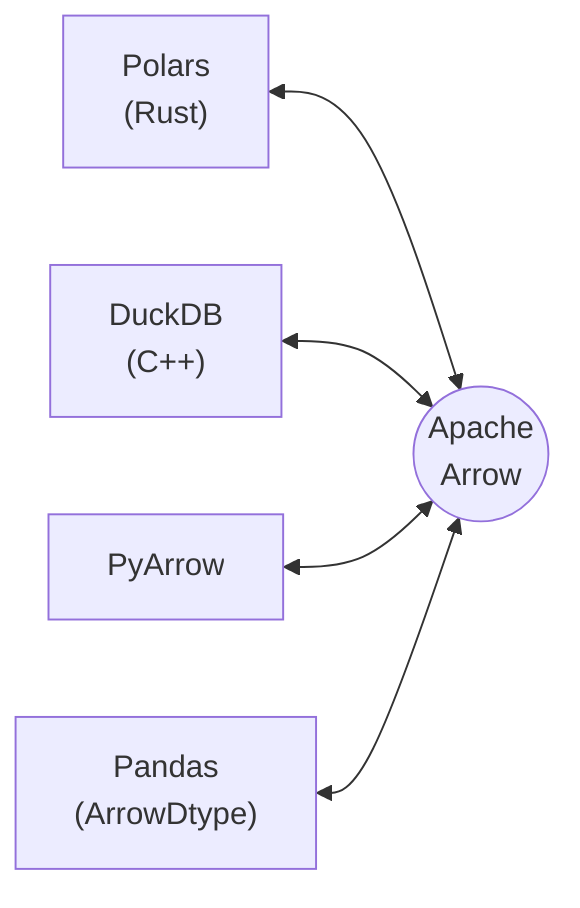

1일차가 **데이터를 믿을 수 있게 만드는 날**이었다면, 2일차는 **그 데이터를 쓸모 있게 만드는 날**이다. 수집·검증 파이프라인으로 확보한 데이터를 탐색하고, 규모를 키우고, 보여주고, 검정하고, 모델에 넘기고, 자동화한다.

```text
Pandas 2.x    →  Polars · DuckDB · Arrow  →  시각화  →  통계·ML  →  자동화·구조화
   탐색              규모와 성능              전달       판단        반복 가능하게
```

2일차의 여섯 주제는 사실상 **같은 집계를 다른 도구로 세 번 다시 쓰는 훈련**이다. Pandas `groupby`로 하던 것을 Polars Lazy로, 다시 DuckDB SQL로 옮겨 쓰고 실행 시간을 비교한다. 도구를 늘리는 것이 목적이 아니라 **언제 무엇을 고를지에 대한 기준**을 세우는 것이 목적이다.

이 파트가 내게는 이번 과정에서 가장 새로웠다. 문법과 환경 설정은 이미 익숙했지만, 데이터를 파일·메모리 포맷 수준에서 다루는 계층 — Arrow, Parquet, Lazy 실행 계획, 파일에 직접 거는 SQL — 은 그동안 "Pandas로 읽으면 되는 것" 정도로만 넘겼던 영역이었다.

## Pandas — 여전히 기본값인 이유

Pandas의 `DataFrame`은 열 이름을 키로 하고 배열을 값으로 갖는 구조다. 1일차에 다룬 `dict`의 확장이라고 봐도 크게 틀리지 않는다. 이 관점이 유용한 이유는 `df['col']`이 왜 O(1)이고, 열 추가는 싼데 행 추가는 비싼지가 자연스럽게 설명되기 때문이다.

### 기초 EDA — 처음 마주쳤을 때의 순서

```python
import pandas as pd

df = pd.read_csv("sales.csv")

df.shape                        # (행, 열)
df.info()                       # 타입 · 결측 · 메모리
df.describe()                   # 수치형 기술통계
df.describe(include="all")      # 범주형 포함

df["date"] = pd.to_datetime(df["date"])
df["region"] = df["region"].astype("category")
```

`astype("category")`는 단순한 타입 지정이 아니라 **메모리 최적화**다. 카디널리티가 낮은 문자열 열을 정수 코드 + 카테고리 사전으로 바꾸므로, 지역명 같은 열에서는 사용량이 크게 줄고 `groupby`도 빨라진다.

`describe()`가 수치형만 보여주는 기본 동작에는 함정이 있다. 숫자로 저장된 ID 열이 끼어 있으면 "평균 고객 ID" 같은 무의미한 통계가 나온다. `df.info()`로 타입을 먼저 확인하고 넘어가는 순서를 지키는 편이 낫다.

### 결측치와 이상치

```python
df.isna().sum()                              # 열별 결측 수
df.isna().sum() / len(df) * 100              # 비율

df["amount"].fillna(df["amount"].median())   # 수치형: 중앙값
df["category"].fillna(df["category"].mode()[0])   # 범주형: 최빈값
df.dropna(subset=["date", "amount"])         # 핵심 열만 기준으로
```

평균이 아니라 중앙값을 쓰는 이유는 평균이 이상치에 끌려가기 때문이다. 매출처럼 오른쪽으로 긴 꼬리를 갖는 분포에서는 특히 그렇다.

IQR 기반 이상치 탐지는 사분위 범위를 쓴다.

$$
\text{IQR} = Q_3 - Q_1, \quad \text{정상 범위} = [\,Q_1 - 1.5\,\text{IQR},\ Q_3 + 1.5\,\text{IQR}\,]
$$

```python
Q1, Q3 = df["amount"].quantile(0.25), df["amount"].quantile(0.75)
IQR = Q3 - Q1
lo, hi = Q1 - 1.5 * IQR, Q3 + 1.5 * IQR

df_clean = df[df["amount"].between(lo, hi)]
print(f"이상치 {(~df['amount'].between(lo, hi)).sum()}건 제거")
```

계수 1.5는 통계적 필연이 아니라 Tukey가 제안한 관례다. 정규분포에서 이 범위를 벗어날 확률이 약 0.7%가 되도록 잡힌 값이라, **분포가 정규에서 멀면 정상값을 이상치로 잘라낼 수 있다.** 로그 정규에 가까운 매출 데이터에 그대로 적용하면 큰 거래가 통째로 날아간다. 제거하기 전에 분포를 먼저 보는 것이 순서다.

`.between()`이 IQR 필터에 잘 맞는 이유는 양끝 포함(inclusive) 비교를 한 번에 하기 때문이고, `~`로 뒤집으면 제거 대상을 그대로 셀 수 있다.

### 집계 — named aggregation

```python
monthly = df.groupby("month").agg(
    revenue=("amount", "sum"),
    cnt=("amount", "count"),
    avg=("amount", "mean"),
).reset_index()
```

`agg({"amount": ["sum", "count", "mean"]})` 형태를 쓰면 결과가 **MultiIndex 열**이 되어 이후 접근이 `df[("amount", "sum")]`처럼 번거로워진다. named aggregation은 결과 열 이름을 직접 지정하므로 평평한 구조가 나온다. 실습 채점 기준에도 이 항목이 명시되어 있었다.

`pivot_table`과 `merge`는 각각 엑셀 피벗과 SQL JOIN에 대응한다.

```python
pivot = df.pivot_table(values="amount", index="region", columns="category",
                       aggfunc="sum", fill_value=0)

result = pd.merge(df_sales, df_cust, on="customer_id", how="left")
```

`merge`는 열 기준, `join`은 인덱스 기준이라는 차이만 기억하면 된다.

### Copy-on-Write — 슬라이드와 실제 동작이 달랐던 부분

Pandas 2.x의 가장 큰 변화로 Copy-on-Write(CoW)가 소개됐다. 그런데 강의자료의 서술과 실제 동작이 어긋나서 직접 확인해 봤다.

> **슬라이드**: "2.0부터 기본 활성화. 뷰(View)를 수정하면 경고/오류 → 명시적 `copy()` 또는 `assign()` 사용 필요"
>
> ```python
> df_seoul = df[df['region'] == '서울']
> df_seoul['amount'] = df_seoul['amount'] * 1.1   # 경고!
> ```

확인해 보니 **두 군데가 부정확했다.**

**첫째, 버전이다.** CoW는 pandas 2.0에서 **옵트인**으로 도입됐다. `pd.options.mode.copy_on_write = True`를 명시해야 켜졌고, 기본값이 된 것은 **3.0**이다. 실습 환경에 설치된 pandas 3.0.3에서는 아예 끌 수 없다.

```python
>>> pd.options.mode.copy_on_write
True
# Pandas4Warning: The 'mode.copy_on_write' option is deprecated.
# Copy-on-Write can no longer be disabled (it is always enabled with pandas >= 3.0)
```

**둘째, 예시 코드가 경고를 내지 않는다.** 실행해 보면 결과는 이렇다.

```python
df = pd.DataFrame({"region": ["서울", "부산", "서울"],
                   "amount": [100.0, 200.0, 300.0]})

sub = df[df["region"] == "서울"]
sub["amount"] = sub["amount"] * 1.1     # 경고 없음

print(df["amount"].tolist())            # [100.0, 200.0, 300.0] — 원본 그대로
```

경고가 없는 것이 정상이고, 그것이 **CoW를 도입한 이유**다. CoW 이전에는 `df[mask]`가 뷰일지 복사본일지 상황에 따라 달라서, pandas가 확신할 수 없을 때 `SettingWithCopyWarning`을 띄웠다. 유명한 "복사본에 값을 설정하려는 것 같습니다" 경고다. CoW에서는 **항상 복사본처럼 동작한다는 것이 보장**되므로 애매함이 사라졌고, 그래서 경고 자체가 필요 없어졌다.

슬라이드가 언급한 `ChainedAssignmentError`는 다른 코드 모양에서 나온다.

```python
df[df["region"] == "서울"]["amount"] = 999.0
# ChainedAssignmentError: A value is being set on a copy of a DataFrame
# ... chained assignment never works to update the original DataFrame ...
print(df["amount"].tolist())            # [100.0, 200.0, 300.0] — 반영 안 됨
```

차이는 **중간 객체를 변수에 담았는가**다. `sub`에 담은 뒤 수정하는 것은 "복사본을 수정하겠다"는 명시적 의사표현이라 아무 문제가 없다. `df[mask]['amount'] = ...`는 이름 없는 중간 객체를 수정하는 것이라 **어차피 원본에 반영될 수 없고**, pandas는 그 의도가 오해임을 알려 준다.

정리하면 이렇다.

| 코드 | CoW에서의 동작 |
|---|---|
| `sub = df[mask]` → `sub['col'] = ...` | 정상. `sub`만 바뀌고 `df`는 그대로 |
| `df[mask]['col'] = ...` | `ChainedAssignmentError`. 원본에 반영 안 됨 |
| `df.loc[mask, 'col'] = ...` | 원본을 바꾸려면 이 형태 |

원본을 실제로 수정하려는 의도라면 `.loc` 단일 단계 대입이 정답이다.

```python
df.loc[df["region"] == "서울", "amount"] *= 1.1
```

> 이 대목이 이번 정리에서 가장 손이 많이 간 부분이다. 슬라이드를 그대로 옮겼다면 "이렇게 쓰면 경고가 난다"고 잘못 적었을 것이고, 그 글을 읽은 사람은 필요 없는 `.copy()`를 방어적으로 붙이게 됐을 것이다. **버전이 바뀌면서 조언의 유효기간이 끝난 경우**라 특히 확인이 필요했다.
{: .prompt-warning }

### apply vs 벡터화

```python
# 느림: 행마다 Python 함수 호출
df["upper"] = df["name"].apply(lambda x: x.upper())

# 빠름: C 레벨에서 일괄 처리
df["upper"] = df["name"].str.upper()

# 날짜도 마찬가지
df["year"] = df["date"].dt.year
df["weekday"] = df["date"].dt.day_name()
```

강의자료는 100만 행 기준 `apply` 약 3.2초 대 `str.upper()` 약 0.08초, 40배 차이를 제시한다. 차이의 원인은 `apply`가 행마다 Python 인터프리터로 돌아와 함수를 호출하는 반면 `.str` 접근자는 반복문 전체가 C에서 도는 데 있다. 1일차에 본 바이트코드 이야기와 같은 맥락이다 — **인터프리터 왕복 횟수가 성능을 지배한다.**

`.apply()`가 언제나 나쁜 것은 아니고, 벡터화된 대응물이 없는 복잡한 행 단위 로직에는 여전히 쓴다. 다만 **먼저 벡터화 방법을 찾아보고 없을 때 쓰는 것**이 순서다.

## Polars와 DuckDB — 규모가 커질 때

### Pandas의 한계

| 한계 | 내용 |
|---|---|
| 싱글스레드 | 코어를 하나만 쓴다 |
| 메모리 | 원본 데이터의 5~10배까지 쓰기도 한다 |
| 즉시 실행 | 연산마다 중간 결과를 만든다 (최적화 여지 없음) |

세 번째가 핵심이다. Pandas는 `df.filter(...).groupby(...).agg(...)`를 쓰면 **각 단계마다 중간 DataFrame을 실제로 만든다.** 필터로 1%만 남길 데이터라도 일단 전체를 읽어 놓는다.

### Polars Lazy API — 실행 계획을 먼저 세운다

```python
import polars as pl

# Eager: 즉시 실행. 탐색·소규모에 적합
df = pl.read_csv("sales.csv")
result = df.filter(pl.col("amount") > 0)

# Lazy: 계획을 세우고 collect()에서 한 번에 실행
result = (
    pl.scan_csv("large.csv", schema_overrides={"amount": pl.Float64})
      .filter(pl.col("region") == "서울")
      .filter(pl.col("amount") > 0)
      .group_by("category")
      .agg([
          pl.col("amount").sum().alias("total"),
          pl.len().alias("cnt"),
      ])
      .sort("total", descending=True)
      .collect()          # 여기서 실제 실행
)
```

`read_csv`가 아니라 **`scan_csv`**로 시작하고 끝에 **`collect()`**를 붙이는 것이 Lazy의 형태다. 그 사이의 체인은 실행이 아니라 **실행 계획의 구성**이다. Polars가 그 계획을 통째로 보고 최적화한다.

두 가지 최적화가 특히 효과가 크다.

- **predicate pushdown** — `filter` 조건을 파일 읽기 단계까지 밀어 넣는다. 조건에 맞지 않는 행은 애초에 메모리에 올라오지 않는다
- **projection pushdown** — 최종 결과에 필요한 열만 읽는다. 100개 열 중 3개만 쓰면 3개만 파싱한다

Pandas가 "읽고 → 버린다"라면 Polars Lazy는 **"버릴 것을 알고 읽지 않는다"**에 가깝다. 이 차이는 데이터가 클수록 벌어진다.

`schema_overrides`로 타입을 명시하는 것도 성능에 영향을 준다. 지정하지 않으면 Polars가 앞부분을 훑어 타입을 추론하는데, 이 과정 자체가 비용이고 추론이 틀리면 나중에 캐스팅이 또 일어난다.

> 강의자료의 Polars 예제는 `pl.count()`를 쓰고 있는데, 현재 권장 API는 **`pl.len()`**이다. `pl.count()`는 deprecated 됐다. 위 코드에는 현재 API를 반영했다.
{: .prompt-info }

Pandas와의 문법 대응은 이렇게 정리된다.

| 작업 | Pandas | Polars |
|---|---|---|
| 열 참조 | `df['col']` | `pl.col('col')` |
| 행 필터 | `df[df['a'] > 0]` | `df.filter(pl.col('a') > 0)` |
| 열 선택 | `df[['a', 'b']]` | `df.select(['a', 'b'])` |
| 열 추가 | `df.assign(x=...)` | `df.with_columns((...).alias('x'))` |
| 집계 | `df.groupby('k').agg(...)` | `df.group_by('k').agg([...])` |
| 상호 변환 | `pl.from_pandas(df)` | `df.to_pandas()` |

가장 큰 개념 차이는 **`pl.col()`이라는 표현식 객체**다. Pandas의 `df['col']`은 즉시 데이터를 가져오지만 `pl.col('col')`은 "이 열을 가리키는 식"이라는 값이고, 아직 아무 데이터도 없다. Lazy 최적화가 가능한 이유가 여기 있다 — 연산이 **데이터가 아니라 식**으로 표현되므로 실행 전에 재배열할 수 있다.

### DuckDB — 파일에 바로 SQL

```python
import duckdb

result = duckdb.sql("""
    SELECT region,
           SUM(amount) AS total,
           AVG(amount) AS avg,
           COUNT(*)    AS cnt
    FROM 'data/*.csv'
    WHERE year = 2024 AND amount > 0
    GROUP BY region
    ORDER BY total DESC
""").df()
```

**로딩 단계가 없다.** `CREATE TABLE`도 `INSERT`도 없고 서버도 없다. 파일 경로를 테이블 자리에 쓰면 와일드카드까지 포함해 그대로 스캔한다. 서로 다른 형식끼리의 조인도 된다.

```python
duckdb.sql("""
    SELECT s.*, c.tier
    FROM 'sales.parquet' s
    JOIN 'customers.csv' c ON s.cid = c.id
""").show()
```

DuckDB의 위치를 한 문장으로 정리하면 **"SQLite가 OLTP에서 하는 일을 OLAP에서 하는 것"**이다. 임베디드로 프로세스 안에서 돌고, 컬럼 지향으로 저장·처리하며, 벡터화 실행 엔진을 쓴다.

[스마트 데이터 시리즈](/posts/skala-smart-data-roadmap/)에서 4일에 걸쳐 다룬 SQL — JOIN, 서브쿼리, CTE, Window Function — 이 여기서 그대로 쓰인다는 점이 반가웠다. 분석 도구를 새로 배우는 대신 **이미 아는 SQL을 파일에 바로 걸 수 있다**는 것이 DuckDB의 실질적 이점이다.

### Apache Arrow — 세 도구를 하나의 생태계로 묶는 것

Polars와 DuckDB를 따로 배우는 것이 아니라 하나로 묶어서 이해해야 하는 이유가 Arrow에 있다.

**Arrow는 컬럼형 인메모리 포맷의 표준 규격**이다. 파일 포맷이 아니라 메모리에 데이터를 어떻게 배치할지에 대한 약속이다.



같은 메모리 레이아웃을 공유하므로 도구 사이를 오갈 때 **직렬화·역직렬화가 필요 없다**. Polars에서 DuckDB로 넘길 때 데이터를 복사하지 않고 포인터만 전달하는 제로카피가 성립한다. 전통적으로 도구 전환 비용의 대부분이 이 변환에서 나왔던 것을 생각하면 큰 차이다.

Parquet은 같은 컬럼형 아이디어를 **디스크에** 적용한 것이다. 열 단위로 저장하므로 필요한 열만 읽을 수 있고(projection pushdown이 파일 수준에서 성립한다), 같은 열의 값끼리 모여 있어 압축률이 높으며, 스키마를 파일에 함께 저장하므로 타입이 보존된다.

> 강의자료는 Parquet에 대해 "CSV 대비 10× 빠른 읽기, 5× 작은 파일 크기"라고 적고 있다. 이 수치는 **대용량 기준의 일반론**으로 읽어야 한다. [1일차 종합실습](/posts/skala-python-day1/)에서 72행 데이터로 직접 측정했을 때는 쓰기·읽기·파일 크기가 **모두 CSV 쪽이 우세**했다. Parquet의 스키마 메타데이터와 열 단위 인코딩에 드는 고정 비용이 작은 데이터에서는 이득을 상쇄하기 때문이다. 반면 자료형 보존은 확실히 차이가 났다.
{: .prompt-warning }

### 언제 무엇을 쓰는가

| 상황 | 도구 | 이유 |
|---|---|---|
| 수십만 행 이하 탐색, Jupyter | Pandas | 생태계와 시각화 연동이 압도적 |
| 수백만 행 이상 변환·집계 | Polars Lazy | 멀티스레드 + pushdown 최적화 |
| 여러 파일에 걸친 조인·집계 | DuckDB | SQL 그대로, 로딩 불필요 |
| 도구 간 데이터 전달 | Arrow | 제로카피 |
| 중간 결과 저장 | Parquet | 타입 보존 + 압축 |

실무적인 흐름은 대개 이렇게 된다. **원본 CSV 수집 → Parquet으로 변환 저장 → Polars/DuckDB로 무거운 집계 → 결과를 Pandas로 받아 시각화.** 각 단계에서 가장 잘하는 도구를 쓰고, 그 사이는 Arrow가 잇는다.

### [실습 3] 세 도구로 같은 집계 쓰기

10만 행 데이터를 대상으로 ① Pandas EDA와 IQR 이상치 제거, ② named aggregation 집계, ③ 같은 집계를 Polars Lazy로, ④ 같은 집계를 DuckDB SQL로 작성하고 `timeit`으로 셋을 비교하는 과제다.

채점 기준의 감점 항목이 이 실습의 의도를 잘 보여준다.

- Polars에서 `scan_csv` 대신 `read_csv` 사용 → Lazy API 미적용
- 체인 끝에 `collect()` 누락 → LazyFrame 상태로 제출
- `timeit` 반복 횟수(`number`)가 도구마다 달라 공정 비교 불가

세 번째가 특히 중요하다. **비교 조건을 통일하지 않은 벤치마크는 숫자가 있어도 아무것도 말해 주지 않는다.** 1일차에 CSV와 Parquet을 한 번씩만 측정하고 "이번 실행 기준"이라는 단서를 달아야 했던 것과 같은 문제다.


## 시각화 — 도구가 넷인 이유

### 왜 그리는가

강의자료가 Anscombe의 사중주로 시작하는 것은 적절한 선택이다. **평균·분산·상관계수가 모두 같은데 산점도를 그리면 완전히 다른 네 데이터셋**은, 요약 통계만 보고 분석을 끝내면 안 되는 이유를 한 장으로 보여준다.

### Matplotlib — Figure와 Axes

Matplotlib을 이해하는 핵심은 두 객체의 구분이다.

- **Figure** — 전체 캔버스. 크기·해상도·배경을 관리한다
- **Axes** — 실제 데이터가 그려지는 개별 플롯. x축·y축·눈금·레이블·제목을 포함한다

`Axes`가 복수형이 아니라 **"축들이 모여 있는 공간"이라는 단수 명사**라는 점이 처음에는 헷갈린다. 하나의 `Axes`가 하나의 그래프다.

```python
import matplotlib.pyplot as plt

fig, axes = plt.subplots(2, 2, figsize=(10, 8))

axes[0, 0].hist(df["amount"], bins=30)
axes[0, 1].boxplot(df["amount"])
axes[1, 0].plot(monthly["month"], monthly["revenue"])
axes[1, 1].imshow(corr_matrix)

plt.tight_layout()
plt.show()
```

`plt.plot(...)` 같은 상태 기반(pyplot) API와 `ax.plot(...)` 같은 객체 지향 API가 섞여 있는데, **서브플롯이 둘 이상이면 객체 지향 쪽만 쓰는 것**이 혼란이 없다. pyplot API는 "현재 Axes"라는 암묵적 상태에 의존하므로, 그래프가 여러 개면 어디에 그려지는지 추적하기 어려워진다.

### Seaborn · Plotly · Altair

| 도구 | 강점 | 쓰는 자리 |
|---|---|---|
| Matplotlib | 픽셀 단위 제어 | 논문·보고서 품질 |
| Seaborn | 통계 시각화, `hue` 한 줄로 다차원 | 분포·상관·그룹 비교 |
| Plotly | 줌·필터·호버, HTML 하나로 공유 | 발표·대시보드 |
| Altair | 선언형, 데이터 구조만 기술 | 빠른 EDA 프로토타이핑 |

Seaborn은 Matplotlib 위에 얹힌 층이라 반환값이 Matplotlib 객체다. 즉 **Seaborn으로 그리고 Matplotlib으로 다듬는** 조합이 자연스럽다.

```python
import seaborn as sns
ax = sns.histplot(df["amount"], kde=True)
ax.set_title("매출 분포")
```

Plotly의 실질적 가치는 **`write_html()` 하나로 인터랙티브 차트를 파일로 떨어뜨릴 수 있다**는 점이다. 받는 사람이 Python을 몰라도 브라우저로 열어 줌·필터를 쓸 수 있다.

```python
import plotly.express as px
fig = px.bar(monthly_df, x="month", y="revenue", color="category", facet_col="region")
fig.write_html("analysis.html")
```

Altair는 Grammar of Graphics 기반이라 접근이 다르다. "이 열을 x에, 저 열을 색에 매핑한다"고 선언하면 차트가 만들어진다.

```python
import altair as alt
chart = (alt.Chart(df)
         .mark_point()
         .encode(x="gdp:Q", y="happiness:Q", color="region:N",
                 tooltip=["country", "gdp", "happiness"])
         .interactive())
chart.save("chart.html")
```

`:Q`(수치)·`:N`(명목)·`:O`(순서)·`:T`(시간) 접미사로 데이터 타입을 명시하는 것이 Altair의 특징이다. 타입에 따라 축 종류와 색 스케일이 자동으로 결정되므로, **타입을 정확히 지정하면 나머지는 알아서 맞는다.**

## 기초 통계와 ML 파이프라인 연결

### 기술통계 — 분포의 모양까지

```python
df.describe()
df["amount"].skew()      # 왜도: 0이면 대칭
df["amount"].kurt()      # 첨도(초과첨도): 0이면 정규분포 수준
corr = df[["amount", "visits", "age"]].corr()
```

`kurt()`가 반환하는 것은 **초과첨도(excess kurtosis)**로, 정규분포의 첨도 3을 빼 둔 값이다. 그래서 정규분포에서 0이 나온다. 값이 양수면 정규분포보다 꼬리가 두껍다는 뜻이고, 이는 **이상치가 나올 확률이 더 높다**는 실무적 의미로 이어진다. 앞서 IQR 계수 1.5가 정규분포 가정 위에 세워진 값이라고 적었는데, 첨도를 먼저 확인하면 그 가정이 성립하는지 알 수 있다.

왜도가 크면 평균과 중앙값이 크게 벌어지므로 결측치를 어느 값으로 채울지에도 영향을 준다. [기초통계 시리즈](/posts/skala-statistics-day1/)에서 다룬 내용이 여기서 실제 코드로 연결된다.

### 가설 검정

```python
from scipy import stats

# t-test: 두 그룹 평균 차이
group_a = df[df["region"] == "서울"]["amount"]
group_b = df[df["region"] == "부산"]["amount"]
t, p = stats.ttest_ind(group_a, group_b)
print(f"t={t:.3f}, p={p:.3f}")
print("통계적으로 유의미한 차이 있음" if p < 0.05 else "차이 없음 (우연일 수 있음)")

# 카이제곱: 두 범주형 변수의 독립성
ct = pd.crosstab(df["region"], df["category"])
chi2, p, dof, expected = stats.chi2_contingency(ct)
```

실습 채점 기준에 "p-value 해석 누락 시 감점"이 명시되어 있는데, 타당한 요구다. `p=0.03`이라는 숫자만 출력하면 아무 판단도 전달되지 않는다.

주의할 점 두 가지를 적어 둔다. **`ttest_ind`의 기본값은 등분산 가정(`equal_var=True`)**이라, 두 그룹의 분산이 다르면 Welch's t-test(`equal_var=False`)를 쓰는 편이 안전하다. 그리고 **표본이 커지면 실질적으로 무의미한 차이도 유의해진다.** p-value는 "차이가 있는가"에 답할 뿐 "차이가 얼마나 큰가"에는 답하지 않으므로, 효과 크기를 함께 봐야 한다.

카이제곱은 기대빈도가 5 미만인 셀이 많으면 근사가 나빠진다. `expected` 반환값을 확인하는 습관을 들이는 편이 낫다.

### CRISP-DM

```text
업무 이해 → 데이터 이해 → 데이터 준비 → 모델링 → 평가 → 배포
 문제 정의    EDA 탐색      전처리·피처   알고리즘   성능 측정  서비스 적용
```

데이터 준비가 전체 공수의 80~90%를 차지한다는 것이 이 방법론의 반복되는 메시지다. 1일차 종합실습에서 실제로 코드의 대부분이 검증과 변환이었던 것을 생각하면 과장이 아니다.

### sklearn Pipeline

```python
from sklearn.pipeline import Pipeline
from sklearn.preprocessing import StandardScaler, OneHotEncoder
from sklearn.compose import ColumnTransformer
from sklearn.linear_model import Ridge
import joblib

preproc = ColumnTransformer([
    ("num", StandardScaler(), num_cols),
    ("cat", OneHotEncoder(handle_unknown="ignore"), cat_cols),
])

model = Pipeline([
    ("prep", preproc),
    ("reg", Ridge(alpha=1.0)),
])

model.fit(X_train, y_train)
print(f"R2: {model.score(X_test, y_test):.3f}")

joblib.dump(model, "model.pkl")
loaded = joblib.load("model.pkl")
```

Pipeline의 가치는 코드 정리가 아니라 **데이터 누수(data leakage) 방지**다. 스케일러를 전체 데이터에 먼저 `fit`한 뒤 나누면 테스트셋의 평균·표준편차가 훈련 과정에 새어 들어가 성능이 부풀려진다. Pipeline 안에 넣으면 `fit`이 훈련 폴드에만 적용되고 `transform`이 테스트 폴드에 적용되므로, 교차 검증에서도 이 경계가 자동으로 지켜진다.

`OneHotEncoder`에 `handle_unknown="ignore"`를 붙인 것은 배포 후 훈련 때 못 본 범주가 들어올 수 있기 때문이다. 기본값이면 그 시점에 예외로 죽는다.

`joblib.dump`가 저장하는 것은 모델 가중치만이 아니라 **전처리기를 포함한 파이프라인 전체**다. 배포 환경에서 전처리 코드를 다시 구현할 필요가 없어지고, 훈련과 추론의 전처리가 어긋나는 문제 — 실무에서 가장 흔한 버그 중 하나 — 가 구조적으로 사라진다. MLOps에서 이 객체 하나가 배포 단위가 되는 이유다.

### [실습 4] 시각화 4종 · 통계 검정 · Pipeline

실습 3에서 정리한 데이터를 이어받아 ① 2×2 서브플롯으로 히스토그램·박스플롯·라인·히트맵, ② t-test와 카이제곱 검정 및 해석, ③ `ColumnTransformer` + `Pipeline` 구성과 joblib 저장, ④ Plotly 차트를 HTML로 저장하는 과제다.

감점 항목이 다시 한번 의도를 드러낸다. "차트 4개를 개별 `plt.show()`로 따로 출력", "p-value 수치만 출력하고 유의미 여부 판단 없음", "전처리와 모델을 개별 단계로 실행하고 Pipeline 객체로 묶지 않음". 셋 다 **결과는 같지만 재사용·전달이 안 되는 형태**를 걸러내는 기준이다.


## 분석 자동화와 코드 구조화

### 자동화

```python
import schedule, time, logging

def run_daily_report():
    try:
        df = load_and_clean("sales.csv")
        stats = compute_stats(df)
        render_report(stats)
        logging.info("리포트 완료")
    except Exception as e:
        logging.error(f"실패: {e}")

schedule.every().day.at("08:00").do(run_daily_report)

while True:
    schedule.run_pending()
    time.sleep(60)
```

`schedule`은 프로세스가 살아 있는 동안만 동작한다. 재부팅이나 프로세스 종료를 견뎌야 하면 OS 레벨 스케줄러(cron, macOS의 launchd)로 올려야 한다. **작업 함수 안에서 예외를 반드시 잡아야 한다**는 점도 중요한데, 예외가 밖으로 나가면 루프가 죽어 이후 모든 실행이 사라진다.

Jinja2로 결과를 HTML 리포트로 뽑는 흐름은 이렇다.

```python
from jinja2 import Environment, FileSystemLoader

env = Environment(loader=FileSystemLoader("templates"))
tmpl = env.get_template("report.html")

html = tmpl.render(
    title="월간 판매 분석",
    generated=datetime.now().strftime("%Y-%m-%d"),
    summary=stats.to_dict(),
    chart_html=fig.to_html(full_html=False),     # Plotly 차트를 통째로 삽입
    top5=df.nlargest(5, "amount").to_dict("records"),
)
Path("output/report.html").write_text(html, encoding="utf-8")
```

`fig.to_html(full_html=False)`가 리포트 자동화의 연결점이다. Plotly 차트를 `<div>` 조각으로 받아 템플릿에 끼워 넣으므로, **인터랙티브 차트가 포함된 리포트를 파일 하나로** 만들 수 있다.

### ETL 구조 원칙

```python
def run_pipeline(config: dict) -> dict:
    logger.info(f"파이프라인 시작: {config}")

    raw = extract(config["source"])                          # E: 수집
    logger.info(f"수집 완료: {len(raw)}건")

    validated, errors = validate(raw, schema=SalesRecord)     # V: 검증
    if errors:
        logger.warning(f"검증 오류: {len(errors)}건")
    ...
```

전통적인 ETL(Extract-Transform-Load) 사이에 **V(Validate)를 끼워 넣은 형태**다. 1일차 종합실습에서 만든 구조와 정확히 같고, 이유도 같다. 각 단계를 독립 함수로 두면 pytest로 따로 테스트할 수 있고, 실패했을 때 어느 단계인지 즉시 알 수 있다.

### 프로젝트 구조

```text
data-project/
├── data/
│   ├── raw/          # 원본 (절대 수정 금지, .gitignore)
│   ├── processed/    # 전처리 완료
│   └── external/     # 외부 참조
├── notebooks/        # EDA·실험
│   └── 01_eda.ipynb
├── src/              # 재사용 가능한 모듈
│   ├── __init__.py
│   ├── clean.py
│   └── viz.py
├── tests/
├── requirements.txt
├── .env.example
└── README.md
```

기준 하나로 정리된다. **노트북은 탐색용, `src/`는 재사용용, 두 역할을 섞지 않는다.** 노트북에서 검증된 함수는 `src/`로 옮기고 노트북은 그것을 임포트해 쓴다. 노트북이 Git에서 다루기 나쁜 이유(셀 출력과 실행 순서가 diff를 오염시킨다)와, 노트북이 EDA에 좋은 이유(중간 결과를 눈으로 보며 진행한다)가 서로 상충하므로 역할을 나누는 것이 답이다.

`data/raw/`를 절대 수정하지 않는다는 규칙도 재현성 문제다. 원본이 바뀌면 그전에 낸 결과를 다시 만들 수 없다. 데이터 자체는 Git에 올리지 않되 **출처(URL·수집 스크립트)를 README에 기록**한다.

> "6개월 뒤 동료(또는 미래의 나)가 README만 읽고 바로 실행할 수 있어야 좋은 구조"라는 자료의 문장이 이 파트의 요약이다. `requirements.txt` + `.env.example` + README 실행 가이드, 이 셋이 재현성의 최소 단위다.
{: .prompt-tip }

## [Day 2 종합실습] End-to-End 데이터 분석 프로젝트

이 글을 쓰는 시점에 진행 중인 과제다. **수행 결과를 지어내지 않기 위해 요구사항과 내 접근 방향까지만 적어 둔다.**

**데이터셋** (택 1)

- NYC Yellow Taxi trip data (Parquet)
- Stack Overflow Developer Survey 2024 (CSV)
- Adult Census Income (UCI, 32,561행 15열)

**요구사항**

| 단계 | 내용 |
|---|---|
| 데이터 준비 | Pandas와 Polars 양쪽으로 로딩해 결과 비교, 결측치·중복 처리, 기초 EDA |
| 시각화 | Seaborn 정적 차트 1개 이상 + Plotly 인터랙티브 차트 1개 이상 (제목·축 레이블 포함) |
| 통계 분석 | 기술통계·상관계수, `ttest_ind`로 t-test 수행 및 p-value 해석 |
| ML Pipeline | `sklearn.pipeline.Pipeline`으로 전처리+모델 구성, 평가 지표 출력, joblib 저장 |
| 자동화 | 분석 결과를 `report.md`로 자동 생성, 팀 발표 5분 |

**접근 방향**

데이터셋은 **NYC Yellow Taxi**를 우선 검토하고 있다. 이미 Parquet으로 제공되어 2일차에 배운 Arrow·컬럼형 포맷의 이점을 실제 규모에서 확인할 수 있고, 수백만 행이라 Pandas와 Polars의 차이가 측정 가능한 수준으로 벌어지기 때문이다. Adult Census는 3만 행이라 두 도구의 차이가 측정 오차에 묻힐 가능성이 크다.

구조는 1일차 파이프라인을 그대로 확장할 계획이다. 수집 대신 로딩이 앞에 오고, 검증 이후에 분석·시각화·모델링 단계가 붙는 형태다.

```text
load (Pandas / Polars 비교)
  → clean (결측·중복·이상치)
    → EDA + 시각화 (Seaborn 정적 · Plotly 인터랙티브)
      → 검정 (t-test · 상관)
        → Pipeline (ColumnTransformer + 모델) → joblib
          → report.md 자동 생성
```

`report.md` 자동 생성에는 Jinja2를 쓰되 출력을 Markdown으로 잡을 생각이다. HTML보다 Git diff에서 읽기 좋고, 이 블로그로 옮겨 오기도 쉽다.


## 정리

2일차를 한 문장으로 요약하면 **"같은 일을 여러 도구로 해 보고 고르는 기준을 만드는 날"**이었다.

| 축 | 배운 기준 |
|---|---|
| 규모 | 수십만 행 이하 Pandas, 그 위로 Polars Lazy / DuckDB |
| 실행 모델 | 즉시 실행(Eager)과 계획 후 실행(Lazy)의 차이, pushdown이 생기는 지점 |
| 저장 포맷 | 사람이 읽고 주고받으면 CSV, 타입 보존과 반복 분석이면 Parquet — 단 규모에 따라 뒤집힌다 |
| 시각화 | 보고서 Matplotlib, 통계 Seaborn, 공유 Plotly, 탐색 Altair |
| 모델링 | 전처리와 모델을 Pipeline 하나로 묶어 누수를 막고 배포 단위를 만든다 |

이틀 전체를 놓고 보면 반복적으로 나타난 패턴이 하나 있다. **경계를 명시적으로 만들면 문제가 그 경계에서 잡힌다.** Pydantic은 시스템 경계에서 잘못된 데이터를 잡고, Pipeline은 훈련/테스트 경계에서 누수를 잡고, pre-commit은 커밋 경계에서 품질 미달 코드를 잡고, Copy-on-Write는 원본과 복사본의 경계를 명확히 해서 "이게 뷰인가 복사본인가"라는 오래된 애매함을 없앴다.

그리고 개인적으로 가장 남는 것은 **측정 없이 성능을 말하지 않는다**는 습관이다. "Parquet이 CSV보다 10배 빠르다", "8코어면 8배 빨라진다", "Polars가 Pandas보다 5~20배 빠르다" — 전부 조건이 붙은 문장인데, 그 조건이 내 상황에 해당하는지는 재 봐야만 안다. 1일차 종합실습에서 내 측정값이 자료의 일반론과 정반대로 나온 경험이 이 습관의 필요성을 가장 잘 설명해 준다.

---

이전 글: [1일차 — 실행 구조부터 비동기 수집 파이프라인까지](/posts/skala-python-day1/)

시리즈 안내: [데이터 분석을 위한 Python — 2일 학습 로드맵](/posts/skala-python-roadmap/)

관련 시리즈: [스마트 데이터 이해 및 활용 — 4일 학습 로드맵](/posts/skala-smart-data-roadmap/) · [데이터 분석 개요 및 기초통계 — 2일 학습 로드맵](/posts/skala-statistics-roadmap/)
