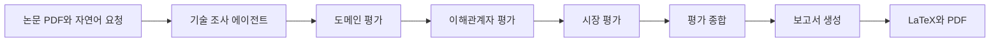
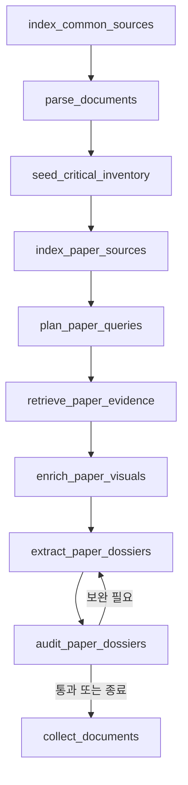

## 기본 RAG에서 Agentic RAG로

Naive RAG는 질문을 한 번 검색하고 답을 만든다. 구성이 단순해 추적하기 쉽지만, 질문이 모호하거나 여러 자료를 연결해야 할 때는 검색 한 번으로 충분하지 않을 수 있다.

Advanced RAG는 이 문제를 검색 전·후 처리로 보완한다. 검색 전에 질의를 다시 쓰거나 여러 질의로 확장하고, 검색 뒤에는 후보를 재순위화하거나 불필요한 문맥을 걸러 낸다. Self-RAG는 검색이 필요한지, 가져온 근거가 관련 있는지, 답이 근거를 따르는지를 reflection token으로 판단한다. Modular RAG는 검색, 라우팅, 메모리, 평가 같은 기능을 모듈로 나누고 선형·분기·반복 패턴으로 조립한다.

Agentic RAG는 이 모듈을 에이전트가 상황에 맞게 선택하고 반복한다. 강의에서 정리한 핵심 능력은 세 가지였다.

- **Reflection**: 현재 결과에 근거가 충분한지 점검한다.
- **Planning**: 큰 요청을 여러 작업으로 나누고 실행 순서를 정한다.
- **Tool use**: 검색기, 데이터베이스, 웹 검색, 코드 실행 같은 외부 도구를 호출한다.

에이전트를 늘리면 전문 역할을 나눌 수 있지만 상태 전달과 실패 처리도 복잡해진다. 어떤 노드가 무엇을 읽고 무엇만 갱신하는지 계약을 먼저 정해야 한다.

## LangGraph로 상태와 흐름을 표현한다

LangGraph에서는 전체 작업 상태를 하나의 State로 두고, 각 Node가 필요한 값을 읽어 일부만 갱신한다. Edge는 다음 노드를 정하고, Conditional Edge는 결과에 따라 정상 진행·보완·중단 경로를 나눈다.

```text
State: 요청, 문서, 근거, 평가 결과, 오류, 사용량
Node:  상태를 읽어 한 작업을 수행하고 변경분을 반환
Edge:  다음 작업으로 이동
Reducer: 여러 노드가 같은 키를 갱신할 때 병합 규칙 적용
```

단순 덮어쓰기는 마지막 결과만 남긴다. 여러 에이전트의 평가를 모으려면 역할별 값을 합치는 reducer가 필요하다. 같은 회차의 충돌을 막고, 보완 회차가 올라갔을 때만 이전 결과를 교체하는 규칙도 둘 수 있다.

이 개념은 팀 프로젝트의 코드 구조에서도 확인할 수 있다. 다만 현재 저장소의 통합 실행기는 세 관점 에이전트를 병렬로 부르는 구조가 아니라 **Domain → Stakeholder → Market** 순서로 실행한다. 각 하위 모듈에는 LangGraph 연결점이 있지만, 루트 pipeline 디렉터리가 실행과 입출력 변환을 맡는다.

## 프로젝트에서 풀고자 한 문제

[KV Cache Multi-Perspective Evaluator](https://github.com/SKALA-4-7-2-3/KV-Cache-Multi-Perspective-Evaluator)는 KV cache 최적화 기술을 여러 관점에서 비교하는 Multi-Agent 기반 Agentic RAG다.

비교 대상은 두 가지다.

- **RDKV**: KV cache의 eviction과 quantization을 함께 고려해 비트를 할당하는 소프트웨어 접근
- **Photonic-CXL**: 광 연결과 CXL 기반 공유 메모리 장치를 이용해 KV cache를 확장·공유하는 하드웨어 접근

같은 KV cache 문제를 다루지만 실험 환경과 검증 수준이 다르다. 따라서 논문 수치만 나란히 놓아 우열을 정하지 않고, 기술 근거와 운영 조건을 분리해 살펴보도록 설계했다. 대상 상황은 장문맥 문서 QA를 제공하는 데이터센터·클라우드 서빙이다.

## 전체 흐름



루트 config/pipeline.json에는 논문 경로, 자연어 요청, 평가 목적과 도메인, RAG 실행 모드가 들어 있다. python -m pipeline을 실행하면 pipeline/__main__.py가 입력과 실행 상태를 읽고 각 단계를 호출한다.

RAG에는 두 가지 모드가 있다.

- **saved**: 이미 만든 기술 조사 결과를 재사용한다. 기본값이다.
- **live** (명령행에서는 --run-rag): 입력 PDF를 다시 파싱하고 검색·추출·감사를 수행한다.

저장 결과를 쓸 때 자연어 요청을 바꾸면 후속 평가에는 반영되지만, 과거 기술 조사 결과가 새 요청으로 다시 생성되지는 않는다. 이 차이를 실행 기록에 남긴다.

각 단계는 JSON이나 Markdown 산출물을 따로 저장한다. run.json에는 모델, 조사 기준일, 입력 해시, 단계별 상태가 남는다. 같은 입력으로 중단된 실행을 이어 가거나 특정 단계부터 다시 실행할 수 있다.

## 저장소를 디렉터리별로 읽어 보기

### config: 한 번의 실행을 정의한다

config/pipeline.json은 두 논문과 사용자의 요청을 연결한다. 현재 기본 요청은 장문맥 문서 QA를 제공하는 데이터센터·클라우드 서빙 관점에서 RDKV와 Photonic-CXL을 비교하는 것이다. 성능 목표나 예산이 입력되지 않았으면 모델이 임의로 만들지 않도록 추가 맥락에도 적어 두었다.

### pipeline: 서로 다른 팀 모듈을 잇는다

pipeline/__main__.py는 전체 실행 진입점이다. 입력과 코드의 해시를 기록하고 prepare, domain, stakeholders, market, review, report 단계를 순서대로 실행한다.

pipeline/research_input.py는 기술 조사 에이전트의 dossier, comparison, evidence registry를 후속 에이전트가 읽을 수 있는 공통 상태로 바꾼다. 모든 원문을 무작정 넘기지 않고 기술 개요·적용 범위·한계를 번갈아 선택한다. 빠진 항목은 context manifest에 기록하고 전체 원본은 별도 bundle에 보존한다.

pipeline/runtime.py는 도메인·이해관계자·시장 에이전트를 실제로 호출한다. pipeline/review_bridge.py는 세 결과와 논문·웹 근거를 종합 에이전트의 입력으로 바꾼다. pipeline/reporting.py는 종합 결과를 보고서 에이전트에 넘기고 LaTeX를 검증한 뒤 PDF로 컴파일한다.

### rag: 기술 조사 에이전트

논문 PDF에서 기술 개요, 적용 범위, 실험 조건, 한계를 추출한다. 모든 주장에는 다시 원문으로 돌아갈 수 있는 evidence ID와 locator를 연결한다. 내가 맡은 부분이 이 에이전트다. 뒤에서 내부 흐름을 더 자세히 정리한다.

### agent/domain: 도메인 적합성

도메인 에이전트는 별도 검색을 하지 않는다. 기술 조사 결과에 들어 있는 근거만 읽고 두 기술을 같은 10개 기준으로 평가한다.

평가 기준에는 용량, 품질, 지연 시간 예측 가능성, 처리량, GPU 호환성, 전용 하드웨어 의존성, 배포 복잡도, 성숙도, 고객 가치, 도메인 적합성이 포함된다. 근거가 없으면 모델을 호출해 채우지 않고 unknown으로 둔다. 다른 기술의 evidence ID를 잘못 인용하는 경우도 차단한다.

### agent/stakeholder: 운영 조직의 이익과 부담

이해관계자 에이전트는 클라우드 데이터센터의 LLM 추론 서비스 운영 조직을 중심으로 본다. 논문 근거에 Tavily 웹 검색을 보태 기대 이익, 도입·운영 부담, 우려, 도입 검토 조건을 정리한다.

논문을 바탕으로 한 조건부 추론과 외부 주체의 실제 발언을 구분한다. CXL 계열 자료를 찾았다고 Photonic-CXL의 실제 도입 사례로 바꾸거나, 일반 KV cache 압축 자료를 RDKV의 성과로 바꾸지 않도록 계약을 둔다. 검색 키가 없으면 논문 근거만 사용한 partial 상태로 남긴다.

### agent/market: 시장과 생태계

시장 에이전트는 시장 규모와 성장, 제품화, 실제 채택, 생태계 지원, 표준화, 비용과 고객 가치, 사업화 조건을 조사한다. 선정 기술의 직접 자료가 부족하면 같은 기술군과 인접 시장으로 범위를 넓히되, 어느 수준의 자료인지 표시한다.

검색, 본문 수집, 종합, 의미 검토를 거친다. 수집한 URL의 제목만 보고 내용을 추측하지 않고 실제 본문을 보존한다. 근거가 부족할 때 만든 정형 fallback 문장은 모델의 결론과 구분한다.

### agent/review: 관점별 결과를 종합한다

종합 에이전트는 세 관점의 일치와 차이를 살피고 기술 성숙도와 조건부 의견을 만든다. 입력 evidence ID가 실제로 존재하는지, 문장의 뜻이 근거보다 넓어지지 않았는지 별도 검사한다.

검사를 통과하지 못한 의견은 억지로 성공 처리하지 않는다. 자료가 비어 있으면 unknown, 에이전트 실행이 실패하면 failed, 근거상 부적합하면 unfavorable로 구분한다. 이 구분이 있어야 “평가할 수 없음”과 “평가 결과가 나쁨”을 섞지 않는다.

### report: 읽을 수 있는 보고서로 바꾼다

보고서 에이전트는 검증된 review.output.md를 읽고 고정된 목차의 한국어 LaTeX를 만든다. 허용된 citation key만 사용했는지, 본문 인용과 참고문헌이 맞는지, 필수 절이 있는지 확인한 뒤 XeLaTeX 또는 Tectonic으로 PDF를 컴파일한다.

컴파일 오류는 제한된 횟수 안에서 모델에 돌려보내 고친다. PDF가 만들어졌다는 사실이 평가 정확도까지 보증하는 것은 아니므로, 미확인 사항과 검토 상태도 보고서에 남긴다.

## 내가 맡은 기술 조사 에이전트

기술 조사 에이전트의 목표는 논문을 자연스럽게 요약하는 것이 아니다. **후속 에이전트가 검증 가능한 기술 주장 묶음을 받도록 만드는 것**이다. 이를 위해 PDF 파싱, 검색, 구조화 추출, 근거 감사, 논문 간 비교를 하나의 그래프로 연결했다.

### 1. 원문을 요소 단위로 분해한다

documents.py는 PyMuPDF로 각 페이지의 텍스트 블록과 좌표를 읽는다. 제목과 섹션, 캡션을 구분하고 물리 페이지와 인쇄 페이지를 함께 기록한다. pdfplumber는 native table을 찾아 Markdown 표로 복원한다.

각 요소에는 안정적인 ID와 bounding box가 붙는다. 표 셀은 행·열을 포함한 locator를 가진다. 나중에 “이 수치가 어느 표의 어느 셀에서 왔는가”를 확인하려면 청크 텍스트만으로는 부족하기 때문이다.

텍스트가 너무 적은 PDF는 failed_ingestion으로 끝낸다. OCR하지 않은 스캔 문서를 정상 처리한 것처럼 넘기지 않는다.

### 2. 검색 설정을 논문마다 만든다

technical_models.py의 query planner는 논문 제목과 초록, 사용자 요청을 바탕으로 검색 질의를 만든다. 기술 개요만 찾지 않고 contribution, conclusion, limitation, appendix, algorithm, equation, ablation, table, figure, latency, throughput, memory, hardware, dataset, baseline 같은 항목을 넓게 확인한다.

초록과 결론의 핵심 주장도 초기 inventory seed로 넣는다. 중요한 결론이 일반 검색 질의에 밀려 사라지는 일을 줄이기 위한 장치다.

### 3. BGE-M3의 세 표현을 나눠 저장한다

bge_retrieval.py는 BGE-M3의 dense, learned sparse, ColBERT 표현을 모두 사용한다.

```text
문서/질의
  ├─ dense 1024차원 ──────────> Chroma cosine 검색
  ├─ learned sparse weight ──> SQLite posting 검색
  └─ token별 ColBERT 1024차원 -> 후보 MaxSim 재순위화
```

dense와 sparse의 상위 결과를 RRF로 합친 뒤 최대 후보 집합을 만든다. 이 후보 안에서 ColBERT MaxSim으로 다시 순위를 매긴다. 여러 질의의 결과를 다시 합치고, 마지막에는 MMR로 관련성과 다양성을 함께 본다. 표나 그림 수치를 묻는 질의에는 관련 visual locator가 후보에서 빠지지 않도록 일부 자리를 예약한다.

인덱스도 한 파일에 몰아넣지 않았다. dense vector, sparse posting, ColBERT 행렬을 각 형식에 맞게 저장하고, 세 표현이 모두 기록된 뒤에만 SQLite의 활성 generation pointer를 바꾼다. 중간에 실패하면 불완전한 새 인덱스 대신 이전 generation이 계속 사용된다.

BGE-M3 모델은 ID만 적어 두지 않고 고정 commit SHA와 파일 SHA-256을 확인한다. 임베딩 모델이나 청킹 설정이 달라진 인덱스를 같은 결과처럼 재사용하지 않도록 profile fingerprint도 만든다.

### 4. 표와 그림의 문맥을 보강한다

검색된 표 값만 남고 캡션이나 열 제목이 빠지면 수치를 해석할 수 없다. evidence_context.py는 캡션과 연결된 주변 문맥을 확장한다. vision.py는 필요한 경우 그림·차트·다이어그램을 렌더링해 시각 정보를 보강한다.

숫자가 들어간 주장은 일반 청크 ID만 허용하지 않는다. 문장 span, 명시적 표 label, 개별 table cell처럼 정확한 locator를 요구한다. 표시된 반올림 값과 논문이 보고한 차이가 다르면 임의 계산으로 바꾸지 않고 저자 보고 값으로 구분하도록 프롬프트에도 명시했다.

### 5. 세 관점으로 dossier를 만든다

검색 근거를 모은 뒤 기술 개요, 적용 범위, 한계를 각각 구조화해 추출한다. 이 세 facet은 병렬로 실행할 수 있고, 실패한 facet만 다시 생성할 수 있다.

- **technical overview**: 문제 정의, 핵심 접근, 메커니즘, 새로움, 실험 결과
- **scope**: 대상 작업과 환경, 데이터셋, 적용 조건, 범위 밖 조건
- **limitations**: 저자가 밝힌 한계, 계산·데이터·일반화·재현성 제약, 보수적으로 추론한 한계

실험 관찰에는 값과 단위뿐 아니라 baseline, 모델, 하드웨어, 문맥 길이, workload, measured·emulated·simulated 여부를 남긴다. 서로 다른 조건의 숫자를 하나로 합치지 않기 위해서다. 특히 물리 장치 측정, 하드웨어 emulation, component simulation, end-to-end serving simulation은 서로 다른 검증 수준으로 유지한다.

### 6. 생성 결과를 계약과 의미로 두 번 검사한다

technical_validation.py는 구조를 검사한다. evidence ID가 존재하는지, 주장이 자기 논문의 근거를 인용하는지, 숫자가 인용한 snippet에 실제로 있는지, critical claim과 inventory가 연결되는지 확인한다.

그 뒤 모델 기반 semantic audit이 각 주장과 실험 관찰을 근거에 대조한다. 누락된 핵심 주제, 수치 불일치, 과도한 일반화를 찾는다. 실패하면 전체를 처음부터 버리지 않고 문제가 있는 facet과 필요한 검색 주제를 정해 보완한다. 기본 최대 2회의 보완 한도를 넘기면 failed_quality로 종료하고 후속 평가를 막는다.

실패 상태도 원인을 나눈다.

| 상태 | 의미 |
|---|---|
| failed_ingestion | PDF 파싱이나 입력 품질 문제 |
| provider_error | 모델 제공자 호출 문제 |
| failed_quality | 보완 뒤에도 근거·품질 계약을 통과하지 못함 |

### 7. 논문별 결과를 비교 가능한 형태로 묶는다

각 논문이 감사까지 통과하면 compare 단계가 논문 사이의 관계, 공통 가정과 다른 가정, 비교 가능한 항목과 비교하면 안 되는 항목, 결합 가설을 만든다. 관찰 ID가 논문 사이에서 충돌하지 않도록 paper ID로 이름공간을 나누고, 공동 실험이 없는 수치를 직접 비교하지 않는다.

성공 결과는 다음 구조로 저장한다.

```text
technical/
├── run.json
├── dossiers/<paper-id>.json
├── comparison.json
├── evidence_registry.json
└── retrieval_traces.jsonl
```

dossiers에는 논문별 분석, comparison.json에는 논문 간 관계, evidence_registry.json에는 원문 근거, retrieval_traces.jsonl에는 질의와 후보 순위가 남는다. 후속 에이전트는 원문 PDF를 다시 열지 않아도 이 계약을 통해 기술 주장과 근거를 함께 받는다.

## 기술 조사 그래프의 실제 노드

research_graph.py의 문서별 subgraph는 다음 순서로 움직인다.



상위 graph는 resolve_sources → research_documents → compare → finalize 순서로 이 subgraph와 논문 비교를 실행한 뒤 최종 envelope를 만든다. SQLite checkpointer를 켜면 중간 상태를 재사용할 수 있다. 논문별 처리와 facet 추출에는 동시성을 쓰되, 모델 제공자에 과도한 요청이 가지 않도록 workflow 전체 semaphore로 제한한다.

## 기술 조사 에이전트에서 중요하게 다룬 경계

첫째, 검색 결과와 검증 결과를 같은 것으로 보지 않았다. 관련 청크를 찾았어도 생성한 문장이 그 근거를 정확히 반영했는지는 다시 검사해야 한다.

둘째, 모델의 매끄러운 설명보다 provenance를 우선했다. 숫자는 조건과 locator가 없으면 비교에서 제외하고, 근거가 부족한 항목은 UnverifiedItem으로 남긴다.

셋째, 저장 결과 재사용의 의미를 명확히 했다. 캐시를 쓰면 비용과 시간을 줄일 수 있지만, 새로운 사용자 요청에 맞춰 논문 조사를 다시 한 것은 아니다. 그래서 통합 파이프라인은 saved와 live를 구분하고 실행 manifest에 남긴다.

넷째, 아직 측정하지 않은 성능을 구현 사실로 대신하지 않았다. BGE-M3 hybrid retrieval과 audit loop를 구현했지만, 프로젝트 저장소에는 Hit Rate@K와 MRR 측정값이 기록돼 있지 않다. 검색 평가용 정답 세트와 실패 사례를 만들어야 다음 개선을 수치로 비교할 수 있다.

## 강의 내용과 프로젝트를 연결해 본 결과

강의에서 배운 전처리, hybrid retrieval, reranking, 평가, Agentic RAG는 프로젝트 안에서 따로 떨어진 기능이 아니었다. PDF의 읽기 순서와 표 셀을 보존하는 일은 검색 품질과 근거 감사로 이어졌다. 검색과 생성의 평가는 dossier 계약과 semantic audit으로 이어졌다. LangGraph의 State, Node, Conditional Edge는 보완이 필요한 항목만 다시 처리하는 흐름으로 이어졌다.

기존 정리에서 바로잡아야 할 부분도 있다. 프로젝트는 일반 논문 리뷰 Agent가 아니라 KV cache 기술을 다중 관점에서 평가하는 시스템이며, 기술 조사 에이전트의 sparse 검색은 BM25가 아니라 BGE-M3 learned sparse다. 앞으로 이 글을 기준으로 프로젝트의 목적과 구현을 설명할 수 있게 됐다.

---

이전 글: [2일차 — 검색·생성·평가 파이프라인](/posts/skala-rag-pipeline-day2/)

시리즈 안내: [RAG Pipeline 설계 및 구축 — 3일 학습 로드맵](/posts/skala-rag-pipeline-roadmap/)
